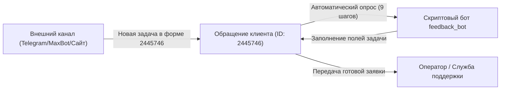
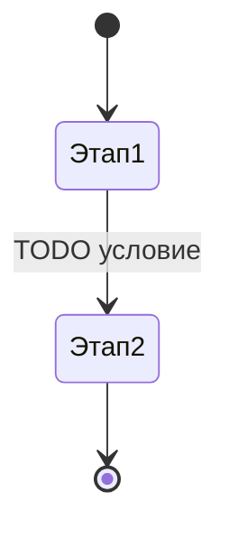

=== [HxqFp6nU6HT] 14.01.2.1 Бизнес-требования ===
# 14.01.2.1 Бизнес-требования

## Зачем этот процесс

Автоматизация сбора обратной связи и обращений клиентов из внешних каналов (мессенджеры, сайт, чат-боты) в Pyrus. Интерактивный диалоговый бот последовательно задаёт гостю 9 уточняющих вопросов, заполняет поля формы № 2445746 и передаёт квалифицированную заявку операторам службы поддержки.

## Кто участвует

| Роль | Что делает | Кто это в организации клиента |
| --- | --- | --- |
| Клиент (Гость) | Направляет обращение через внешний канал, отвечает на вопросы бота | Посетитель ресторана / клиент службы доставки |
| Серверный бот (`feedback_bot`) | Проводит пошаговый опрос (9 вопросов), валидирует ответы, заполняет поля формы | Автоматический ассистент Pyrus API |
| Оператор / Служба поддержки | Обрабатывает заполненное обращение после завершения опроса ботом | Сотрудники Сервис-Деска / управляющие ресторанов |

## Граф зависимостей



| Связь | Направление | Что передаётся | Что сломается при изменении |
| --- | --- | --- | --- |
| Внешний канал → Форма 2445746 | входящая | Текст первого обращения клиента | Диалог не начнётся, если канал не передаст событие создания задачи |
| Бот → Заявка Pyrus | внутреннее | Значения полей `client_name`, `client_phone`, `problem_type` и т.д. | Ошибка заполнения полей при изменении кодов полей формы |

## Границы процесса

- **Входит в объём:**
    - 9-шаговый интерактивный диалог бота с клиентом (Имя, Телефон, Email, Тип проблемы, Предмет проблемы, Описание, Фото, Торговая точка, Оценка).
    - Заполнение 100% затронутых полей задачи.
    - Валидация формата телефона (`7XXXXXXXXXX`), e-mail, числовых шкал (1-5) и парсинг числовых выборов (1-7, 1-14).
    - Защита от зацикливания, собственного эха бота и дублирования webhook по `last_event_key`.
    - Передача задачи операторам (`Status: Новое обращение` / завершение опроса).
- **Не входит:**
    - Пополнение справочников торговых точек и типов проблем из бота (выполняется администратором).
    - Ручная обработка жалобы оператором после прохождения опроса.

## Требования заказчика

1. Бот опрашивает гостя по строго зафиксированной цепочке из 9 вопросов.
2. Поддерживается ввод ответов выборов (Тип/Предмет проблемы) как цифрой (1, 2, 3...), так и по названию.
3. Валидация телефона приведёт любой корректный ввод (например `+7 (999) 111-22-33`, `89991112233`) к единому стандарту `79991112233`.
4. Вопрос про E-mail допускает текстовый отказ ("нет", "не хочу").
5. При превышении лимита ошибок (3 неудачных ввода) или превышении количества переспросов одного поля (4 раза) бот прекращает опрос и передаёт задачу оператору.

## Нефункциональные требования

- **Часовой пояс аккаунта Pyrus клиента:** UTC+3 (Москва).
- **Дедупликация событий:** бот игнорирует собственные комментарии (`author.id === request.user_id`) и дублирующие webhook по `state.last_event_key`.
- **Отсутствие состояния в памяти:** состояние бота (`technical_bot_state`) полностью хранится в техническом поле задачи Pyrus.
- **Время отклика:** обработка комментариев в рамках лимитов Pyrus API (до 60 секунд на прогон).

## Открытые вопросы

| Вопрос | Кому адресован | Статус |
| --- | --- | --- |
| Отправка во внешний канал `channel` | Инженер интеграции | Включена в логику бота |


=== [Pz08EhIgG1h] 14.01.2.2 Спецификация полей ===
# 14.01.2.2 Спецификация полей

## Состав полей (Форма ID: 2445746)

Спецификация полей формы «Обращение клиента» (ID 2445746), полученная из Pyrus API:

| Название поля | Технический код (`code`) | ID | Тип поля Pyrus | Раздел | Описание / Шаг бота | Условия видимости |
| --- | --- | --- | --- | --- | --- | --- |
| Имя клиента | `client_name` | 1 | `text` | — | Шаг 1: Имя гостя | Всегда |
| Телефон | `client_phone` | 2 | `phone` | — | Шаг 2: Телефон (7XXXXXXXXXX) | Всегда |
| Эл. почта | `client_email` | 3 | `email` | — | Шаг 3: Email (или "нет") | Всегда |
| Суть обращения | — | 10 | `title` | — | Заголовок раздела | Есть |
| Канал обращения | `channel` | 5 | `catalog` | Суть обращения | Внешний канал (ID: 303716) | Заголовок 10 |
| Тип проблемы | `problem_type` | 17 | `catalog` | Суть обращения | Шаг 4: Справочник 304202 (1-7) | Заголовок 10 |
| Предмет проблемы | `problem_subject` | 19 | `catalog` | Суть обращения | Шаг 5: Справочник 304204 (1-14) | Заголовок 10 |
| Описание проблемы | `problem_description` | 8 | `text` | Суть обращения | Шаг 6: Подробный текст | Заголовок 10 |
| Фото / скриншоты | `attachments` | 9 | `file` | Суть обращения | Шаг 7: Вложения | Заголовок 10 |
| Привязка к ресторану | — | 11 | `title` | — | Заголовок раздела | Есть |
| Торговая точка | `location` | 13 | `catalog` | Привязка к ресторану | Шаг 8: Справочник 303701 | Заголовок 11 |
| Оценка | — | 14 | `title` | — | Заголовок раздела | Есть |
| Оценка гостя | `rating` | 15 | `multiple_choice` | Оценка | Шаг 9: Варианты 1, 2, 3, 4, 5 | Заголовок 14 |
| Статус | `Status` | 16 | `multiple_choice` | — | Статус обращения (1-4) | Всегда |
| Состояние бота | `technical_bot_state` | 21 | `note` / `text` | — | Технический JSON состояния | Скрыто / Примечание |

## Обязательность и ограничения

| Поле | Обязательное | Ограничения / Формат | Что происходит при нарушении |
| --- | --- | --- | --- |
| `client_name` | Нет | Текст до 255 символов | Переспрос бота при пустом вводе |
| `client_phone` | Нет | Телефон: `7XXXXXXXXXX` (11 цифр) | Переспрос с образцом формата |
| `client_email` | Нет | Валидный e-mail или отказ ("нет") | Переспрос при невалидном e-mail |
| `problem_type` | Нет | Элемент справочника 304202 (1..7) | Переспрос с выводом вариантов 1-7 |
| `problem_subject` | Нет | Элемент справочника 304204 (1..14) | Переспрос с выводом вариантов 1-14 |
| `problem_description` | Нет | Произвольный текст | Принимается любой текст |
| `attachments` | Нет | Вложенные файлы / картинки / "нет" | Бот запрашивает вложения |
| `location` | Нет | Текст / адрес ресторана | Сопоставление со справочником 303701 |
| `rating` | Нет | Выбор `multiple_choice` (1..5) | Переспрос при выходе из диапазона 1-5 |

## Поля, скрытые от клиента

| Поле | Кто видит | Зачем |
| --- | --- | --- |
| `technical_bot_state` | Бот / Администратор | JSON состояния бота: `step_field_code`, `ask_counts`, `error_count`, `completed_steps`, `last_event_key`, `finished` |

## Справочники, используемые формой

| Поле | Справочник | `catalog_id` | Колонка поиска |
| --- | --- | --- | --- |
| `channel` | Канал обращения | 303716 | 0 (Канал) |
| `problem_type` | Тип проблемы | 304202 | 0 (Тип проблемы) |
| `problem_subject` | Предмет проблемы | 304204 | 0 (Предмет проблемы) |
| `location` | Торговая точка | 303701 | 0 (Список ресторанов) |


=== [SJTwkjuQ4Dw] 14.01.2.3 Маршрутизация ===
# 14.01.2.3 Маршрутизация

## Этапы

| № | Этап | Исполнитель (роль) | Что делает | Условие перехода дальше |
| --- | --- | --- | --- | --- |
| 1 | TODO | TODO | TODO | TODO |

## Схема



## Возвраты и отклонения

Куда задача уходит, если этап не пройден. Незадокументированный возврат — самая частая причина «задача зависла и никто не знает, у кого она».

| С какого этапа | Причина возврата | Куда возвращается | Кто уведомляется |
| --- | --- | --- | --- |
| TODO | TODO | TODO | TODO |

## Сроки

| Этап | Норматив | Что происходит при просрочке |
| --- | --- | --- |
| TODO | TODO часов | TODO |

## Автоматические переходы

Какие переходы делает бот, а какие — человек. Для каждого автоматического: триггер и условие.

| Переход | Триггер | Условие | Исполняет |
| --- | --- | --- | --- |
| TODO | TODO | TODO | бот / человек |


=== [PBMidjqmInH] 14.01.2.4 Скрипты и боты ===
# 14.01.2.4 Скрипты и боты

## Серверные боты

| Бот | Файл | Триггер | Что делает |
| --- | --- | --- | --- |
| `feedback_bot` | `Forms/02_Обращения_клиентов/scripts/feedback_bot (v1.0).ts` | Создание задачи / новый комментарий | Пошаговый сбор 9 полей обратной связи через интерактивный опрос гостя |

### Схема пошагового опроса (9 шагов)

1. **`client_name` (Имя):** "Укажите, пожалуйста, Ваше имя или как к Вам обращаться."
2. **`client_phone` (Телефон):** "Укажите, пожалуйста, номер телефона для связи (в формате 7XXXXXXXXXX)."
3. **`client_email` (Email):** "Укажите, пожалуйста, адрес электронной почты (или напишите 'Нет')."
4. **`problem_type` (Тип проблемы):** "Выберите категорию Вашего вопроса (ответьте цифрой 1-7 или названием):" (1. Качество еды, 2. Обслуживание, 3. Чистота, 4. Скорость, 5. Комплектация, 6. Цена, 7. Другое).
5. **`problem_subject` (Предмет проблемы):** "Уточните, что именно произошло (ответьте цифрой 1-14 или названием):" (1. Вкус, 2. Температура, 3. Вес, 4. Неверный состав, 5. Отсутствие ингредиента, 6. Инородный предмет, 7. Горелое/сырое, 8. Упаковка, 9. Хамство, 10. Грязный зал, 11. Долгое ожидание, 12. Ошибка в заказе, 13. Оплата, 14. Другое).
6. **`problem_description` (Описание проблемы):** "Опишите, пожалуйста, ситуацию подробно. Что именно случилось, когда, какие были обстоятельства?"
7. **`attachments` (Фото / скриншоты):** "Приложите фото/видео или скриншот, подтверждающий проблему."
8. **`location` (Торговая точка):** "Укажите, пожалуйста, адрес ресторана, о котором идёт речь (например: 'Ресторан 1', 'Планерная 87')."
9. **`rating` (Оценка гостя):** "Оцените, пожалуйста, Ваше общее впечатление по шкале от 1 до 5, где 1 – очень плохо, 5 – отлично."

### Ограничения и предохранители (Fuses)

- **`last_event_key` deduplication:** отсечение повторных вызовов webhook для одного и того же комментария (`comment.id`).
- **Игнорирование собственного эха:** комментарии с `author.id === request.user_id` пропускаются.
- **Max Asks Fuse:** если одно и то же поле запрашивается более 4 раз (`ask_counts[code] > 4`), опрос прерывается (`finished: true`), а задача передаётся оператору.
- **Max Errors Fuse:** при 3 подряд нераспознанных ответах (`error_count >= 3`) бот завершает опрос (`finished: true`) и запрашивает вмешательство человека.

## Что переиспользовано из Банка функций

| Блок | Зачем здесь |
| --- | --- |
| `FormModel` / `TaskModel` | Рекурсивное чтение полей задачи, включая вложенные в заголовки (`title`) |
| `ExtendedClient` | Управление вызовами API Pyrus и пакетным формированием `field_updates` |
| `same_value` | Предотвращение дублирующих обновлений полей |
| Парсеры валидации | Проверка формата телефона, e-mail, выборов списка по номерам/названиям и числовой шкалы |

## Формат технического состояния (`technical_bot_state`)

```json
{
  "step_field_code": "client_phone",
  "error_count": 0,
  "completed_steps": ["client_name"],
  "ask_counts": { "client_name": 1, "client_phone": 1 },
  "finished": false,
  "last_event_key": "12345678"
}
```


=== [HBrFmU7qcyd] 14.01.2.5 Подпроцессы и связи ===
# 14.01.2.5 Подпроцессы и связи

## Запускаемые подпроцессы

| Подпроцесс (форма) | Когда запускается | Кто запускает | Что происходит с родительской задачей |
| --- | --- | --- | --- |
| TODO | TODO | бот / человек | ждёт завершения / продолжается независимо |

## Маппинг полей

Что именно переносится в дочернюю задачу. Незадокументированный маппинг — источник расхождений, которые находят по жалобе клиента.

| Поле-источник (Обращения\_клиентов) | Поле-приёмник | Преобразование |
| --- | --- | --- |
| `todo_code` | `todo_code` | без изменений |
| TODO | TODO | TODO |

Отдельно фиксируется обратная передача: что дочерняя задача возвращает в родительскую и в какой момент.

| Поле дочерней задачи | Куда возвращается | Когда |
| --- | --- | --- |
| TODO | TODO | TODO |

## Входящие связи

Кто создаёт задачи по этой форме и что передаёт.

| Источник | Способ | Что передаёт |
| --- | --- | --- |
| TODO | форма / бот / внешняя система | TODO |

## Внешние интеграции

| Система | Направление | Протокол | Что передаётся | Что делать при недоступности |
| --- | --- | --- | --- | --- |
| TODO | TODO | REST / вебхук | TODO | TODO |

## Анализ влияния

При изменении этой формы проверить перечисленные выше связи и подсветить скрипты, которые могут сломаться. Машинно-выводимая карта связей лежит в разделе «Банк решений» и строится по исходникам и заголовкам документов.


=== [JbeUl8Qr1fc] 14.01.2.6 Справочники ===
# 14.01.2.6 Справочники — состав и влияние

Справочник — самостоятельная сущность со своим жизненным циклом, а не приложение к форме. Форма без актуального справочника перестаёт работать, поэтому он описывается отдельно и в двух аудиториях: здесь — что это и на что влияет, в пользовательском разделе — как с ним работать.

Если справочник используется несколькими формами, он описывается **один раз**, а формы ссылаются на это описание.

## Справочник: TODO название

- **`catalog_id`:** TODO
- **Назначение:** TODO — зачем он существует.
- **Владелец:** TODO — чьё решение добавлять и удалять строки.
- **Ссылка в Pyrus:** TODO

### Состав колонок

| № | Колонка | Тип | Обязательная | Пример значения | Комментарий |
| --- | --- | --- | --- | --- | --- |
| 0 | TODO | текст | да | TODO | по этой колонке идёт поиск |
| 1 | TODO | число | нет | TODO | TODO |

Порядок колонок значим: поиск строки по умолчанию идёт по колонке 0. Если скрипт ищет по другой колонке, это указывается явно — иначе перестановка колонок молча сломает подстановку.

### Где используется

| Форма | Поле (`code`) | Как используется |
| --- | --- | --- |
| Обращения\_клиентов | `todo_code` | выбор значения пользователем |
| TODO | `todo_code` | подстановка ботом при копировании |

### На что влияет изменение

Что именно сломается, если строку изменить, переименовать или удалить.

| Изменение | Последствие | Где проявится |
| --- | --- | --- |
| Переименование строки | Условия видимости и маршрутизация, сравнивающие **текст** значения, перестают срабатывать | TODO |
| Удаление строки | В уже созданных задачах значение остаётся, но новые подстановки не находят строку; бот уходит в ветку «не найдено» | TODO |
| Добавление колонки в середину | Поиск по номеру колонки начинает читать не те данные | скрипты, использующие `columnIndex` |
| Добавление строки | Появляется новый вариант ответа; бот начнёт предлагать его клиенту | TODO |

Поэтому строки **выводят из обращения**, а не удаляют: удаление рвёт историю в уже созданных задачах.

### Связанные справочники

| Справочник | Правило связи | Что произойдёт при рассинхроне |
| --- | --- | --- |
| TODO | TODO | TODO |

### Кто и как пополняет

Процедура для пользователя описана в пользовательской статье «04 Справочники — как пополнять». Здесь — техническая сторона: TODO (ручное ведение / синхронизация ботом / импорт из внешней системы, с какой периодичностью).


=== [EOe26XDNj1w] 14.01.2.7 Роли и права ===
# 14.01.2.7 Роли и права

## Роли формы

| Роль в Pyrus | Кто входит | Права на форму | На каких этапах участвует |
| --- | --- | --- | --- |
| TODO | TODO | Заполнение / Редактирование / Администрирование | TODO |

## Права бота

Бот — виртуальный сотрудник со своим `user_id`. Чтобы читать задачу и писать поля, он обязан быть участником формы.

| Бот | Права на форму | Системные права | Зачем |
| --- | --- | --- | --- |
| TODO | TODO | «Управляющий интеграциями» / «Управляющий» | «Управляющий» нужен только для создания и синхронизации справочников |

## Видимость полей по ролям

| Поле | Кто видит | Кто редактирует |
| --- | --- | --- |
| `technical_bot_state` | администраторы | бот |
| TODO | TODO | TODO |

## Доступ к документации

Раздел этой формы в Базе знаний открывается клиенту вместе с его ТЗ: и пользовательская, и техническая часть, и исходный код — это описание его собственных процессов и оплаченная им разработка. Наработки по другим клиентам в этот раздел не помещаются.

| Кому | Что открыто |
| --- | --- |
| Сотрудники клиента | пользовательская документация |
| Ответственные со стороны клиента | техническая документация и исходники |
| Инженеры внедрения | всё, включая Банк решений |


=== [Ku01XwgJZN4] 14.01.2.8 Печатные формы ===
# 14.01.2.8 Печатные формы

## Шаблоны

| Документ | Формат | Файл шаблона | Когда формируется | Кто формирует |
| --- | --- | --- | --- | --- |
| TODO | Word / Excel / PDF | TODO | TODO | человек / бот |

## Подстановка полей

| Плейсхолдер в шаблоне | Поле формы (`code`) | Формат вывода |
| --- | --- | --- |
| `{TODO}` | `todo_code` | TODO |

Для дат и денег формат вывода указывается явно: шаблон, собранный «как получится», в первом же документе для контрагента выглядит как ошибка.

## Таблицы в шаблоне

| Плейсхолдер | Источник строк | Колонки |
| --- | --- | --- |
| TODO | таблица `todo_code` | TODO |

## Проверка перед выдачей

- Пустые обязательные поля не должны попадать в документ пустыми местами — TODO описать поведение.
- Кто подписывает и на каком этапе: TODO.

Если печатных форм в процессе нет, статья остаётся с явной пометкой «не используется» — пустой раздел без объяснения читается как незаконченная работа.


=== [OXZ4F0dsbGj] 14.01.2.9 Банк ответов ===
# 14.01.2.9 Банк ответов

Шаблоны быстрых ответов оператора и текстов, которые бот отправляет клиенту. Держатся в одном месте, чтобы формулировки не расходились между операторами и не приходилось искать их по коду бота.

## Тексты бота

| Ситуация | Текст | Где в коде |
| --- | --- | --- |
| Приветствие и первый вопрос | TODO | `todo_bot (v1.0).ts`, `MSG` |
| Ответ не распознан | TODO | TODO |
| Передача оператору | TODO | TODO |
| Все данные собраны | TODO | TODO |
| Технический сбой | TODO | TODO |

Изменение текста бота — правка кода, поэтому идёт через версию файла и запись в историю изменений.

## Шаблоны ответов оператора

| Ситуация | Текст | Примечание |
| --- | --- | --- |
| TODO | TODO | TODO |

## Правила формулировок

- Обращение к клиенту: TODO (на «вы» / по имени).
- Что оператор **не** обещает клиенту без согласования: TODO (сроки, скидки, замена товара).
- Тон и границы: TODO.


=== [S8FbuAvo9Zh] 14.01.2.10 Тест кейсы ===
# 14.01.2.10 Тест кейсы и приёмка

## Сценарии приёмки

| № | Сценарий | Шаги | Ожидаемый результат | Статус |
| --- | --- | --- | --- | --- |
| 1 | Happy path | TODO | TODO | не проверено |
| 2 | TODO | TODO | TODO | не проверено |

## Краевые случаи

Проверяется то, что ломалось на живых формах:

| Случай | Ожидаемое поведение |
| --- | --- |
| Клиент отвечает не по формату (текст вместо числа) | Бот переспрашивает, счётчик ошибок растёт; после TODO ошибок зовёт оператора |
| Клиент отвечает отрицанием («не надо») на вопрос с галочкой | Значение `unchecked`, а не `checked` |
| Значение `0` в числовом поле и снятая галочка | Считаются заполненными там, где это осмысленно, и не вызывают повторный вопрос |
| Поле скрыто условием видимости | Вопрос по нему не задаётся |
| Строка справочника не найдена | Поле не заполняется, событие попадает в лог; молча подставлять соседнюю строку запрещено |
| Тот же вебхук пришёл дважды | Второй вызов не создаёт повторный комментарий (`last_event_key`) |
| Бот прокомментировал сам себя | Игнорируется (`author.id === request.user_id`) |
| Справочник недоступен | Бот не падает; поведение TODO |
| Время указано клиентом в местном поясе | В поле записано UTC со смещением TODO |

## Локальный прогон

Логика проверяется симулятором до деплоя — `npm run test`. Сеть в тестах подменена: ответы Pyrus объявляются маршрутами, а незаявленный вызов попадает в `network.unmatched` и обязан быть проверен на пустоту.

## Приёмка заказчиком

| Что проверяет заказчик | Кто присутствует | Дата | Результат |
| --- | --- | --- | --- |
| TODO | TODO | TODO | TODO |


=== [UJbV1US0q1a] 14.01.2.11 Runbook ===
# 14.01.2.11 Runbook

Что делать, когда процесс сломался. Пишется до запуска, а не после первого инцидента.

## Куда смотреть

| Что | Где |
| --- | --- |
| Журнал событий бота | Профиль бота в Pyrus → Журнал событий |
| Внутренние комментарии бота | В самой задаче, без внешнего канала |
| Состояние диалога | Поле `technical_bot_state` задачи |
| Исходный код | `Forms/02_Обращения_клиентов/scripts/` |

## Типовые сбои

| Симптом | Вероятная причина | Что делать |
| --- | --- | --- |
| Бот задаёт один и тот же вопрос по кругу | Состояние не читается: техническое поле вложено в заголовок, а код перебирает только верхний уровень `task.fields` | Проверить чтение через `FormModel` / `TaskModel`; убедиться, что поле найдено по коду, а не по индексу |
| Бот молчит | Не является участником формы, либо упал на необработанном исключении | Проверить права бота и журнал событий |
| Поле не заполняется из справочника | Строка не найдена или найдено несколько | Проверить точное значение и дубли в справочнике |
| Клиент видит служебные сообщения | Комментарий отправлен с `channel` | Внутренние логи идут без канала |
| Бот отвечает с задержкой или пропускает события | Упёрлись в лимит 10 запусков за 10 секунд | Проверить, не комментирует ли бот сам себя |
| Время в поле смещено на несколько часов | Смещение часового пояса не совпадает с аккаунтом клиента | Сверить смещение с настройкой аккаунта |

## Аварийная остановка

1. Отключить бота в профиле (задачи продолжат работать, автоматизация остановится).
2. Предупредить TODO ответственного со стороны клиента.
3. Задачи, оставшиеся на этапе сбора данных, передать оператору вручную.

## Контакты

| Роль | Кто | Связь |
| --- | --- | --- |
| Ответственный со стороны клиента | TODO | TODO |
| Инженер внедрения | TODO | TODO |


=== [K6vE0H8Fjq2] 14.01.2.99 История изменений ===
# 14.01.2.99 История изменений

- v1.0 (10.08.2026): Раздел заведён по шаблону формы «Обращения\_клиентов».


=== [EsZuSe0iu6P] 14.01.2.1.1 Код: feedback_bot.ts ===
# 14.01.2.1.1 Код: feedback\_bot (v1.0).ts

```typescript
import {
  BotHookRequest,
  BotHookResponse,
  PyrusApiClient,
  FormResponse
} from "pyrus-api";

// ═══════════════════════════════════════════════════════════════════════════
//  БОТ ОБРАЩЕНИЙ КЛИЕНТОВ (форма «Обращение клиента», ID 2445746)
//
//  Пошаговый сбор 9 полей обратной связи через интерактивный опрос:
//    1. client_name — Имя гостя
//    2. client_phone — Телефон (7XXXXXXXXXX)
//    3. client_email — Email (или "нет")
//    4. problem_type — Тип проблемы (Справочник 304202, варианты 1-7)
//    5. problem_subject — Предмет проблемы (Справочник 304204, варианты 1-14)
//    6. problem_description — Описание проблемы
//    7. attachments — Фото / скриншоты
//    8. location — Торговая точка (Справочник 303701)
//    9. rating — Оценка гостя (Выбор 1-5)
// ═══════════════════════════════════════════════════════════════════════════

const FIELD_CODES = {
  STATE: "technical_bot_state",
  CLIENT_NAME: "client_name",
  CLIENT_PHONE: "client_phone",
  CLIENT_EMAIL: "client_email",
  PROBLEM_TYPE: "problem_type",
  PROBLEM_SUBJECT: "problem_subject",
  PROBLEM_DESCRIPTION: "problem_description",
  ATTACHMENTS: "attachments",
  LOCATION: "location",
  RATING: "rating",
} as const;

const DEBUG_ENABLED = true;
const MAX_ERRORS = 3;
const MAX_ASKS_PER_FIELD = 4;

const OPERATOR_TRIGGERS = [
  "оператор", "позовите", "человек", "менеджер", "поговорить с человеком", "оператора"
];

const SKIP_ANSWERS = [
  "нет", "не надо", "не нужно", "пропустить", "пропуск", "далее", "дальше",
  "skip", "-", "без разницы", "не знаю", "неважно", "не важно", "нету"
];

type StepType =
  | "text" | "phone" | "email" | "number" | "choice" | "catalog"
  | "checkmark" | "file" | "time" | "date";

interface StepDefinition {
  code: string;
  question: string;
  hint?: string;
  type?: StepType;
  optional?: boolean;
  min?: number;
  max?: number;
}

const ASK_SEQUENCE: StepDefinition[] = [
  {
    code: FIELD_CODES.CLIENT_NAME,
    question: "Здравствуйте! Укажите, пожалуйста, Ваше имя или как к Вам обращаться?",
    min: 2,
    max: 100
  },
  {
    code: FIELD_CODES.CLIENT_PHONE,
    question: "Укажите, пожалуйста, номер телефона для связи.",
    hint: "Формат: 7XXXXXXXXXX или 8XXXXXXXXXX."
  },
  {
    code: FIELD_CODES.CLIENT_EMAIL,
    question: "Укажите, пожалуйста, адрес электронной почты (если есть).",
    hint: "Можете написать: Нет (если не хотите).",
    optional: true
  },
  {
    code: FIELD_CODES.PROBLEM_TYPE,
    question: "Выберите категорию Вашего вопроса:\n(Можно ответить цифрой):\n\n1. Качество еды или напитков\n2. Обслуживание (персонал)\n3. Чистота и порядок\n4. Скорость обслуживания или доставки\n5. Комплектация заказа (что-то забыли, перепутали)\n6. Цена или соотношение цены и качества\n7. Другое"
  },
  {
    code: FIELD_CODES.PROBLEM_SUBJECT,
    question: "Уточните, пожалуйста, что именно произошло. Выберите наиболее подходящий вариант:\n(Можно ответить цифрой):\n\n1. Вкус блюда (не понравился, слишком солёное и т.п.)\n2. Температура блюда (холодное, горячее не так)\n3. Недостаточный вес или маленькая порция\n4. Неверный состав (положили не то, что заказывали)\n5. Отсутствие ингредиента (например, нет соуса)\n6. Инородный предмет в еде\n7. Горелое, пережаренное или сырое\n8. Упаковка (повреждена, плохо упаковано)\n9. Хамство или невнимательность персонала\n10. Грязный зал или столы\n11. Долгое ожидание заказа\n12. Ошибка в заказе (перепутали блюда)\n13. Проблема с оплатой\n14. Другое (опишите в следующем вопросе)"
  },
  {
    code: FIELD_CODES.PROBLEM_DESCRIPTION,
    question: "Опишите, пожалуйста, ситуацию подробно. Что именно случилось, когда, какие были обстоятельства?",
    min: 3,
    max: 2000
  },
  {
    code: FIELD_CODES.ATTACHMENTS,
    question: "Приложите фото/видео или скриншот, подтверждающий проблему.",
    hint: "Если фото нет, просто напишите «нет».",
    type: "file",
    optional: true
  },
  {
    code: FIELD_CODES.LOCATION,
    question: "Укажите, пожалуйста, адрес ресторана, о котором идёт речь.",
    hint: "Например: «Ресторан 1» или «Планерная 87»."
  },
  {
    code: FIELD_CODES.RATING,
    question: "Оцените, пожалуйста, Ваше общее впечатление по шкале от 1 до 5, где 1 – очень плохо, 5 – отлично.",
    hint: "Ответьте цифрой от 1 до 5."
  }
];

const MSG = {
  OPERATOR: "Уже зову коллегу — оператор подключится к диалогу в ближайшее время.",
  GIVE_UP: "Не получается разобрать ответ. Передаю диалог оператору, он свяжется с Вами.",
  DONE: "Спасибо! Все данные по Вашему обращению собраны. Наш специалист уже занимается решением вопроса.",
  INTERNAL_ERROR: "Извините, произошёл технический сбой. Передаю диалог оператору.",
};

interface BotState {
  step_field_code: string | null;
  error_count: number;
  completed_steps: string[];
  ask_counts: Record<string, number>;
  finished: boolean;
  last_event_key: string | null;
}

interface FieldSchema {
  id: number;
  code?: string;
  name: string;
  type: string;
  parentId?: number;
  options?: Array<{ choice_id: number; choice_value: string; deleted?: boolean }>;
  catalogId?: number;
  multiple: boolean;
  visibility?: any;
  required: boolean;
}

interface Trigger {
  key: string | null;
  text: string;
  attachments: any[];
  channel: any;
}

const logs: string[] = [];
function log(msg: string): void {
  if (!DEBUG_ENABLED) return;
  logs.push(msg);
}

class FormModel {
  readonly byId = new Map<number, FieldSchema>();
  readonly byCode = new Map<string, FieldSchema>();
  private readonly catalogCache = new Map<number, any[]>();

  private constructor(rawFields: any[], readonly source: "form_api" | "task_fallback") {
    this.walk(rawFields, undefined);
  }

  static async load(client: PyrusApiClient, formId: number, taskFields: any[]): Promise<FormModel> {
    if (formId) {
      try {
        const formDef: FormResponse = await client.forms.get({ id: formId });
        if (formDef?.fields?.length) {
          const model = new FormModel(formDef.fields as any[], "form_api");
          log(`Схема формы ${formId}: ${model.byId.size} полей (из API), с кодами: ${model.byCode.size}`);
          return model;
        }
      } catch (e: any) {
        log(`Не удалось получить схему формы ${formId}: ${e?.message || e}. Используем структуру из задачи`);
      }
    }
    const model = new FormModel(taskFields || [], "task_fallback");
    log(`Схема восстановлена из задачи: ${model.byId.size} полей, с кодами: ${model.byCode.size}`);
    return model;
  }

  private walk(fields: any[], parentId: number | undefined): void {
    for (const f of fields || []) {
      if (!f || typeof f !== "object" || f.id === undefined || f.id === null) continue;
      const info = f.info || {};
      const schema: FieldSchema = {
        id: Number(f.id),
        code: f.code || info.code || undefined,
        name: f.name || "",
        type: String(f.type || "text"),
        parentId,
        options: info.options || f.options,
        catalogId: info.catalog_id ?? f.catalog_id,
        multiple: Boolean(info.multiple_choice ?? f.multiple_choice),
        visibility: f.visibility_condition || info.visibility_condition,
        required: Boolean(info.is_required ?? f.is_required),
      };

      if (!this.byId.has(schema.id)) this.byId.set(schema.id, schema);
      if (schema.code && !this.byCode.has(schema.code)) this.byCode.set(schema.code, schema);

      for (const children of this.childrenOf(f)) this.walk(children, schema.id);
    }
  }

  private childrenOf(f: any): any[][] {
    const out: any[][] = [];
    const push = (v: any) => { if (Array.isArray(v) && v.length) out.push(v); };

    push(f.fields);
    push(f.info?.fields);
    push(f.info?.columns);
    if (f.value && !Array.isArray(f.value)) push(f.value.fields);
    if (Array.isArray(f.value) && (f.type === "group" || f.type === "title")) push(f.value);
    for (const opt of f.info?.options || []) push(opt?.fields);
    if (Array.isArray(f.value)) {
      for (const row of f.value) if (row && Array.isArray(row.cells)) push(row.cells);
    }
    return out;
  }

  idOf(code: string): number | undefined {
    return this.byCode.get(code)?.id;
  }

  async optionsFor(client: PyrusApiClient, schema: FieldSchema): Promise<string[]> {
    if (schema.type === "checkmark") return ["Да", "Нет"];

    if (schema.options?.length) {
      return schema.options
        .filter(o => o && o.choice_value && o.choice_value !== "Не выбрано" && !o.deleted)
        .slice(0, 20)
        .map(o => o.choice_value);
    }

    if (schema.type === "catalog" && schema.catalogId) {
      const items = await this.catalogItems(client, schema.catalogId);
      return items.slice(0, 30).map(i => i?.values?.[0]).filter(Boolean);
    }

    return [];
  }

  async catalogItems(client: PyrusApiClient, catalogId: number): Promise<any[]> {
    const cached = this.catalogCache.get(catalogId);
    if (cached) return cached;
    try {
      const response = await client.catalogs.get({ id: catalogId });
      const items = response?.items || [];
      this.catalogCache.set(catalogId, items);
      return items;
    } catch (e: any) {
      log(`Каталог ${catalogId} недоступен: ${e?.message || e}`);
      this.catalogCache.set(catalogId, []);
      return [];
    }
  }
}

class TaskModel {
  private readonly values = new Map<number, any>();

  constructor(fields: any[]) {
    this.walk(fields);
  }

  private walk(fields: any[]): void {
    for (const f of fields || []) {
      if (!f || typeof f !== "object" || f.id === undefined || f.id === null) continue;
      if (f.value !== undefined && f.value !== null) this.values.set(Number(f.id), f.value);

      const value = f.value;
      if (value && !Array.isArray(value) && Array.isArray(value.fields)) this.walk(value.fields);
      else if (Array.isArray(value) && (f.type === "group" || f.type === "title")) this.walk(value);
      if (Array.isArray(f.fields)) this.walk(f.fields);
    }
  }

  get(id: number | undefined): any {
    return id === undefined ? undefined : this.values.get(Number(id));
  }

  getByCode(form: FormModel, code: string): any {
    return this.get(form.idOf(code));
  }

  set(id: number, value: any): void {
    this.values.set(Number(id), value);
  }
}

function isEmptyValue(value: any, type: string): boolean {
  if (value === undefined || value === null || value === "") return true;
  if (type === "checkmark") return value !== "checked" && value !== true;
  if (Array.isArray(value)) return value.length === 0;
  if (typeof value === "object") {
    if (Array.isArray(value.choice_ids)) return value.choice_ids.length === 0;
    if (Array.isArray(value.item_ids)) return value.item_ids.length === 0;
    if (value.choice_id !== undefined || value.item_id !== undefined) return false;
    if (Array.isArray(value.fields)) return true;
    return Object.keys(value).length === 0;
  }
  return false;
}

function valueChoiceId(value: any): string {
  if (!value || typeof value !== "object") return "";
  if (Array.isArray(value.choice_ids) && value.choice_ids.length) return String(value.choice_ids[0]);
  if (value.choice_id !== undefined) return String(value.choice_id);
  if (Array.isArray(value.item_ids) && value.item_ids.length) return String(value.item_ids[0]);
  if (value.item_id !== undefined) return String(value.item_id);
  return "";
}

function valueDisplay(value: any, schema: FieldSchema | undefined): string {
  if (value === undefined || value === null) return "";
  if (typeof value === "string") return value;
  if (typeof value === "number" || typeof value === "boolean") return String(value);
  if (Array.isArray(value)) return value.map(v => valueDisplay(v, schema)).join(", ");

  if (typeof value === "object") {
    if (Array.isArray(value.choice_names) && value.choice_names.length) return String(value.choice_names[0]);
    const choiceId = valueChoiceId(value);
    if (choiceId && schema?.options?.length) {
      const opt = schema.options.find(o => String(o.choice_id) === choiceId);
      if (opt) return opt.choice_value;
    }
    if (Array.isArray(value.values) && value.values.length) return String(value.values[0]);
    if (Array.isArray(value.item_names) && value.item_names.length) return String(value.item_names[0]);
    if (choiceId) return choiceId;
  }
  return "";
}

function evaluateCondition(condition: any, form: FormModel, values: TaskModel): boolean {
  if (!condition) return true;

  const { field_id, condition_type, value, children } = condition;
  const kids: any[] = Array.isArray(children) ? children : [];

  if (condition_type === 11) return kids.every(c => evaluateCondition(c, form, values));
  if (condition_type === 10) return kids.some(c => evaluateCondition(c, form, values));

  if (!field_id) return kids.length ? kids.every(c => evaluateCondition(c, form, values)) : true;

  const schema = form.byId.get(Number(field_id));
  const raw = values.get(Number(field_id));
  const type = schema?.type || "text";

  // Если проверяется этап задачи (step), и он не заполнен — считаем этап 1 (первичная работа с обращением)
  if (type === "step" && (raw === undefined || raw === null || raw === "")) {
    if (String(value ?? "") === "1") return true;
  }

  const filled = !isEmptyValue(raw, type);

  const target = String(value ?? "").trim().toLowerCase();
  const asText = valueDisplay(raw, schema).trim().toLowerCase();
  const asId = valueChoiceId(raw) || (type === "checkmark" ? (raw === "checked" ? "1" : "0") : "");

  switch (condition_type) {
    case 1:
    case 3:
      return filled;
    case 2:
    case 4:
      return !filled;
    case 5:
      return (asId !== "" && asId === target) || (asText !== "" && asText === target);
    case 6:
      return !((asId !== "" && asId === target) || (asText !== "" && asText === target));
    default:
      return true;
  }
}

function isFieldVisible(schema: FieldSchema, form: FormModel, values: TaskModel): boolean {
  let current: FieldSchema | undefined = schema;
  const guard = new Set<number>();
  while (current && !guard.has(current.id)) {
    guard.add(current.id);
    if (current.visibility && !evaluateCondition(current.visibility, form, values)) return false;
    current = current.parentId === undefined ? undefined : form.byId.get(current.parentId);
  }
  return true;
}

function normalize(s: string): string {
  return (s || "").trim().toLowerCase().replace(/ё/g, "е");
}

function findBestMatch(input: string, options: string[]): string | undefined {
  const value = normalize(input);
  if (!value || !options.length) return undefined;

  const exact = options.find(o => normalize(o) === value);
  if (exact) return exact;

  const contains = options.filter(o => {
    const opt = normalize(o);
    return opt.includes(value) || value.includes(opt);
  });
  if (contains.length === 1) return contains[0];

  const inputWords = value.split(/\s+/).filter(w => w.length >= 3);
  const matches = options.filter(o => {
    const optWords = normalize(o).split(/\s+/).filter(w => w.length >= 3);
    return inputWords.some(iw =>
      optWords.some(ow => ow.startsWith(iw.substring(0, 3)) || iw.startsWith(ow.substring(0, 3)))
    );
  });
  return matches.length === 1 ? matches[0] : undefined;
}

function parsePhone(input: string): string | undefined {
  const digits = (input || "").replace(/\D/g, "");
  let normalized = digits;
  if (digits.length === 11 && (digits.startsWith("8") || digits.startsWith("7"))) normalized = "7" + digits.slice(1);
  else if (digits.length === 10 && digits.startsWith("9")) normalized = "7" + digits;
  return /^7\d{10}$/.test(normalized) ? normalized : undefined;
}

function parseEmail(input: string): string | undefined {
  const value = (input || "").trim();
  return /^[^\s@]+@[^\s@]+\.[^\s@]+$/.test(value) ? value : undefined;
}

function parseNumber(input: string, step: StepDefinition): number | undefined {
  const match = (input || "").replace(",", ".").match(/-?\d+(\.\d+)?/);
  if (!match) return undefined;
  const value = parseFloat(match[0]);
  if (!isFinite(value)) return undefined;
  if (step.min !== undefined && value < step.min) return undefined;
  if (step.max !== undefined && value > step.max) return undefined;
  return value;
}

function pickOption(input: string, options: string[]): string | undefined {
  const value = (input || "").trim();
  if (/^\d{1,2}$/.test(value)) {
    const index = parseInt(value, 10) - 1;
    if (index >= 0 && index < options.length) return options[index];
  }
  return findBestMatch(value, options);
}

function isSkipAnswer(input: string): boolean {
  const value = normalize(input);
  return value.length > 0 && SKIP_ANSWERS.includes(value);
}

interface ParseResult {
  value?: any;
  skipped?: boolean;
  failed?: boolean;
}

async function parseAnswer(
  step: StepDefinition,
  schema: FieldSchema,
  type: StepType,
  text: string,
  attachments: any[],
  options: string[],
  client: PyrusApiClient,
  form: FormModel
): Promise<ParseResult> {
  if (type === "file") {
    if (attachments.length) {
      const uploaded = await uploadAttachments(attachments, client);
      return uploaded.length ? { value: uploaded } : { failed: true };
    }
    return step.optional && text ? { skipped: true } : { failed: true };
  }

  if (!text) return { failed: true };
  if (step.optional && isSkipAnswer(text)) return { skipped: true };

  switch (type) {
    case "phone": {
      const phone = parsePhone(text);
      return phone ? { value: phone } : { failed: true };
    }
    case "email": {
      const email = parseEmail(text);
      return email ? { value: email } : { failed: true };
    }
    case "number": {
      const num = parseNumber(text, step);
      return num === undefined ? { failed: true } : { value: num };
    }
    case "choice": {
      const label = pickOption(text, options);
      if (!label) return { failed: true };
      const option = schema.options?.find(o => o.choice_value === label || normalize(o.choice_value) === normalize(label));
      if (!option) return { failed: true };
      return { value: schema.multiple ? { choice_ids: [option.choice_id] } : { choice_id: option.choice_id } };
    }
    case "catalog": {
      const label = pickOption(text, options);
      if (!label || !schema.catalogId) return { failed: true };
      const items = await form.catalogItems(client, schema.catalogId);
      const item = items.find(i => i?.values?.[0] === label || normalize(i?.values?.[0]) === normalize(label));
      if (!item) return { failed: true };
      return { value: schema.multiple ? { item_ids: [item.item_id] } : { item_id: item.item_id } };
    }
    default: {
      const value = text.trim();
      if (step.min !== undefined && value.length < step.min) return { failed: true };
      if (step.max !== undefined && value.length > step.max) return { failed: true };
      return { value };
    }
  }
}

async function uploadAttachments(attachments: any[], client: PyrusApiClient): Promise<any[]> {
  const files: any[] = [];
  for (const att of attachments) {
    if (!att?.id) continue;
    try {
      const blob = await client.files.download({ id: att.id });
      const uploaded = await client.files.upload(blob, att.name || `file_${att.id}`);
      if (uploaded?.guid) files.push({ guid: uploaded.guid, name: att.name });
    } catch (e: any) {
      log(`Не удалось перенести вложение ${att.name || att.id}: ${e?.message || e}`);
    }
  }
  return files;
}

function resolveStepType(step: StepDefinition, schema: FieldSchema): StepType {
  if (step.type) return step.type;
  switch (schema.type) {
    case "phone": return "phone";
    case "email": return "email";
    case "number":
    case "money": return "number";
    case "multiple_choice":
    case "choice": return "choice";
    case "catalog": return "catalog";
    case "checkmark": return "checkmark";
    case "file": return "file";
    default: return "text";
  }
}

function emptyState(): BotState {
  return {
    step_field_code: null,
    error_count: 0,
    completed_steps: [],
    ask_counts: {},
    finished: false,
    last_event_key: null,
  };
}

function parseState(raw: any): BotState {
  const state = emptyState();
  if (typeof raw !== "string" || !raw.trim()) return state;
  try {
    const parsed = JSON.parse(raw);
    if (!parsed || typeof parsed !== "object") return state;
    if (typeof parsed.step_field_code === "string") state.step_field_code = parsed.step_field_code;
    if (typeof parsed.error_count === "number") state.error_count = parsed.error_count;
    if (Array.isArray(parsed.completed_steps)) {
      state.completed_steps = parsed.completed_steps.filter((s: any) => typeof s === "string");
    }
    if (parsed.ask_counts && typeof parsed.ask_counts === "object") state.ask_counts = parsed.ask_counts;
    state.finished = parsed.finished === true;
    if (parsed.last_event_key !== undefined && parsed.last_event_key !== null) {
      state.last_event_key = String(parsed.last_event_key);
    }
  } catch (e: any) {
    log(`Состояние повреждено (${e?.message || e}) — начинаю с чистого`);
  }
  return state;
}

function extractTrigger(task: any, botUserId: number): Trigger {
  const comments: any[] = Array.isArray(task?.comments) ? task.comments : [];
  const result: Trigger = { key: null, text: "", attachments: [], channel: undefined };

  for (let i = comments.length - 1; i >= 0; i--) {
    const c = comments[i];
    if (!c) continue;

    const rawText = (c.text || c.formatted_text || c.subject || "").trim();

    // Пропускаем собственные отладочные комментарии бота
    if (rawText.startsWith("[BOT-DEBUG")) continue;

    // Игнорируем сообщения от самого бота, кроме входящих сообщений из канала
    if (c.author?.id === botUserId && c.channel?.direction !== "inbound") continue;
    if (c.channel?.direction === "outbound") continue;

    if (!result.channel && c.channel) {
      result.channel = c.channel;
    }

    const text = rawText;
    const attachments = Array.isArray(c.attachments) ? c.attachments : [];
    if (!result.key && (text || attachments.length)) {
      result.key = c.id !== undefined ? String(c.id) : null;
      result.text = text;
      result.attachments = attachments;
    }
    if (result.key && result.channel) break;
  }

  // Если задача только создана из Telegram и в комментариях ещё нет текста, берем заголовок/текст задачи
  if (!result.text && (task.text || task.subject || task.formatted_text)) {
    result.text = (task.text || task.subject || task.formatted_text || "").trim();
    if (!result.key) result.key = `task_init_${task.id}`;
  }

  if (!result.channel) {
    for (let i = comments.length - 1; i >= 0; i--) {
      if (comments[i]?.channel) {
        result.channel = comments[i].channel;
        break;
      }
    }
  }

  return result;
}

export default async function (request: BotHookRequest): Promise<BotHookResponse | null> {
  logs.length = 0;
  const task: any = (request as any)?.task;
  const client = new PyrusApiClient(request.access_token);
  const taskId = Number(task?.id ?? (request as any)?.task_id ?? 0);

  let reply: any = null;
  try {
    reply = await run(request, task, client);
  } catch (e: any) {
    log(`ФАТАЛЬНАЯ ОШИБКА: ${e?.message || e}\n${e?.stack || ""}`);
    reply = {
      text: MSG.INTERNAL_ERROR,
      approval_choice: "approved",
      channel: extractTrigger(task, request.user_id).channel,
    };
  }

  await flushLogs(client, taskId);
  return reply;
}

function buildFieldUpdates(updates: any[], stateFieldId: number | undefined, state: BotState): any[] {
  const result = [...updates];
  if (stateFieldId) {
    result.push({ id: stateFieldId, value: JSON.stringify(state) });
  }
  return result;
}

function extractStateFromComments(task: any): BotState {
  const comments: any[] = Array.isArray(task?.comments) ? task.comments : [];
  for (let i = comments.length - 1; i >= 0; i--) {
    const text = comments[i]?.text || comments[i]?.formatted_text || "";
    const match = text.match(/\[BOT-STATE:\s*(\{.*?\})\]/s);
    if (match) {
      try {
        const parsed = parseState(match[1]);
        if (parsed) return parsed;
      } catch (e) {
        // continue
      }
    }
  }
  return emptyState();
}

async function run(request: BotHookRequest, task: any, client: PyrusApiClient): Promise<any> {
  if (!task) { log("В запросе нет задачи — выходим"); return null; }

  const formId = Number(task.form_id ?? (request as any).form_id ?? 0);
  const form = await FormModel.load(client, formId, task.fields || []);
  const values = new TaskModel(task.fields || []);

  const stateFieldId = form.idOf(FIELD_CODES.STATE);
  let state: BotState;
  if (stateFieldId) {
    state = parseState(values.get(stateFieldId));
    log(`Техническое поле состояния: id=${stateFieldId}, состояние=${JSON.stringify(state)}`);
  } else {
    state = extractStateFromComments(task);
    log(`Техполе '${FIELD_CODES.STATE}' отсутствует — состояние прочитано из комментариев: ${JSON.stringify(state)}`);
  }

  if (state.finished) { log("Диалог уже завершён — бот молчит"); return null; }

  const trigger = extractTrigger(task, request.user_id);
  log(`Триггер: key=${trigger.key}, текст="${trigger.text}", вложений=${trigger.attachments.length}`);

  if (trigger.key && trigger.key === state.last_event_key) {
    log("Этот комментарий уже обработан — повторный вызов хука, выходим");
    return null;
  }

  const triggerText = trigger.text;
  if (triggerText && normalize(triggerText) === "/start" && state.step_field_code) {
    log("Получена команда /start во время диалога — повторно выводим текущий вопрос");
    const currentStep = ASK_SEQUENCE.find(s => s.code === state.step_field_code);

    if (currentStep) {
      state.last_event_key = trigger.key;
      let questionText = currentStep.question;
      if (currentStep.hint) questionText += `\n(${currentStep.hint})`;
      return {
        text: questionText,
        channel: trigger.channel,
        field_updates: buildFieldUpdates([], stateFieldId, state)
      };
    }
  }

  if (triggerText && OPERATOR_TRIGGERS.some(t => normalize(triggerText).includes(t))) {
    log("Гость попросил оператора — передаём задачу человеку");
    state.finished = true;
    state.last_event_key = trigger.key;
    return {
      text: MSG.OPERATOR,
      approval_choice: "approved",
      channel: trigger.channel,
      field_updates: buildFieldUpdates([], stateFieldId, state)
    };
  }

  const fieldUpdates: any[] = [];

  // ── 5. Разбор ответа гостя на ТЕКУЩИЙ шаг ──────────────────────────────
  if (state.step_field_code) {
    const currentStep = ASK_SEQUENCE.find(s => s.code === state.step_field_code);
    const schema = currentStep ? form.byCode.get(currentStep.code) : undefined;

    if (currentStep && schema) {
      const type = resolveStepType(currentStep, schema);
      const options = await form.optionsFor(client, schema);
      log(`Разбираем ответ на шаг '${currentStep.code}' (тип=${type}): "${triggerText}"`);

      const parsed = await parseAnswer(
        currentStep, schema, type, triggerText, trigger.attachments, options, client, form
      );

      if (parsed.failed) {
        state.error_count++;
        log(`Не удалось распознать ответ (${state.error_count}/${MAX_ERRORS})`);

        if (state.error_count >= MAX_ERRORS) {
          state.finished = true;
          state.last_event_key = trigger.key;
          return {
            text: MSG.GIVE_UP,
            approval_choice: "approved",
            channel: trigger.channel,
            field_updates: buildFieldUpdates([], stateFieldId, state)
          };
        }

        const askCount = (state.ask_counts[currentStep.code] || 1) + 1;
        state.ask_counts[currentStep.code] = askCount;
        state.last_event_key = trigger.key;

        let questionText = `Не удалось распознать ответ. ${currentStep.question}`;
        if (currentStep.hint) questionText += ` (${currentStep.hint})`;

        return {
          text: questionText,
          channel: trigger.channel,
          field_updates: buildFieldUpdates([], stateFieldId, state)
        };
      }

      state.error_count = 0;
      if (!state.completed_steps.includes(currentStep.code)) {
        state.completed_steps.push(currentStep.code);
      }

      if (parsed.value !== undefined) {
        log(`Записываем поле '${currentStep.code}' (id=${schema.id}): ${JSON.stringify(parsed.value)}`);
        fieldUpdates.push({ id: schema.id, value: parsed.value });
        values.set(schema.id, parsed.value);
      }
    }
  }

  // ── 6. Поиск СЛЕДУЮЩЕГО поля для опроса ─────────────────────────────────
  let nextStep: StepDefinition | undefined;
  let nextSchema: FieldSchema | undefined;

  for (const step of ASK_SEQUENCE) {
    const schema = form.byCode.get(step.code);
    if (!schema) {
      log(`Поле ${step.code} отсутствует в схеме формы — пропускаем`);
      continue;
    }

    if (!isFieldVisible(schema, form, values)) {
      log(`Поле ${step.code} (id=${schema.id}) скрыто условием видимости — пропускаем`);
      continue;
    }

    const currentVal = values.get(schema.id);
    const filled = !isEmptyValue(currentVal, schema.type);
    log(`Поле ${step.code} (id=${schema.id}): заполнено=${filled}, в completed=${state.completed_steps.includes(step.code)}`);

    if (!filled && !state.completed_steps.includes(step.code)) {
      const askCount = state.ask_counts[step.code] || 0;
      if (askCount >= MAX_ASKS_PER_FIELD) {
        log(`Поле ${step.code} запрашивали уже ${askCount} раз — прекращаем диалог`);
        state.finished = true;
        state.last_event_key = trigger.key;
        return {
          text: MSG.GIVE_UP,
          approval_choice: "approved",
          channel: trigger.channel,
          field_updates: buildFieldUpdates(fieldUpdates, stateFieldId, state)
        };
      }

      nextStep = step;
      nextSchema = schema;
      break;
    }
  }

  state.last_event_key = trigger.key;

  // ── 7. Финал: все поля собраны ──────────────────────────────────────────
  if (!nextStep || !nextSchema) {
    log("Все данные собраны — завершаем диалог");
    state.step_field_code = null;
    state.finished = true;

    const finalUpdates = buildFieldUpdates(fieldUpdates, stateFieldId, state);
    const statusFieldId = form.idOf("Status") || 16;
    if (statusFieldId) {
      finalUpdates.push({ id: statusFieldId, value: { choice_id: 1 } });
    }

    return {
      text: MSG.DONE,
      approval_choice: "approved",
      channel: trigger.channel,
      field_updates: finalUpdates
    };
  }

  // ── 8. Формируем вопрос по следующему полю ──────────────────────────────
  state.step_field_code = nextStep.code;
  state.ask_counts[nextStep.code] = (state.ask_counts[nextStep.code] || 0) + 1;

  let questionText = nextStep.question;
  if (nextStep.hint) questionText += `\n(${nextStep.hint})`;

  log(`Задаём вопрос по полю '${nextStep.code}': "${questionText.slice(0, 60)}..."`);
  return {
    text: questionText,
    channel: trigger.channel,
    field_updates: buildFieldUpdates(fieldUpdates, stateFieldId, state)
  };
}

async function flushLogs(client: PyrusApiClient, taskId: number): Promise<void> {
  if (!DEBUG_ENABLED || !logs.length || !taskId) return;
  const text = `[BOT-DEBUG]\n${logs.join("\n")}`;
  try {
    await client.tasks.addComment(taskId, { text: text.slice(0, 10000) });
  } catch (e: any) {
    // Игнорируем ошибки логирования
  }
}
```

