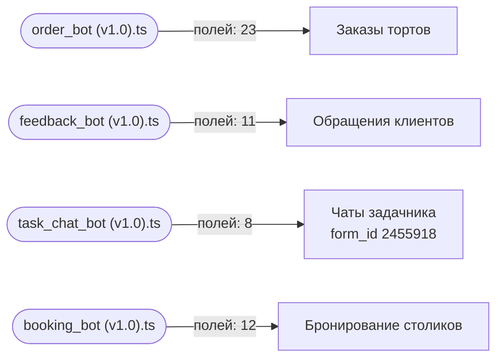

Карта строится автоматически из исходников и заголовков документов — `npm run map`. Править её руками бессмысленно: следующая генерация перезапишет файл, а `npm run check` не даст закоммитить расхождение.

Карта отвечает на вопрос «меняю поле — что сломается»: ниже видно, какой скрипт какое поле трогает.

## Схема

## Формы

| Форма | `form_id` | Справочники | Полей в спецификации | Скриптов |
| --- | --- | --- | --- | --- |
| Заказы тортов | — | — | 24 | 1 |
| Обращения клиентов | — | — | 1 | 1 |
| Чаты задачника | 2455918 | — | 11 | 1 |
| Бронирование столиков | — | — | 12 | 1 |

## Заказы тортов: какие поля трогают скрипты

| Поле (`code`) | Скрипты | Объявлено в спецификации |
| --- | --- | --- |
| `allergy_comment` | order_bot (v1.0).ts | да |
| `bonus_accrual` | order_bot (v1.0).ts | да |
| `bonus_card_create` | order_bot (v1.0).ts | да |
| `bonus_card_exists` | order_bot (v1.0).ts | да |
| `bonus_write_off` | order_bot (v1.0).ts | да |
| `cake_filling` | order_bot (v1.0).ts | да |
| `cake_for` | order_bot (v1.0).ts | да |
| `cake_weight` | order_bot (v1.0).ts | да |
| `child_gender` | order_bot (v1.0).ts | да |
| `delivery_address` | order_bot (v1.0).ts | да |
| `delivery_contact` | order_bot (v1.0).ts | да |
| `delivery_time_range` | order_bot (v1.0).ts | да |
| `delivery_type` | order_bot (v1.0).ts | да |
| `design_comment` | order_bot (v1.0).ts | да |
| `design_image` | order_bot (v1.0).ts | да |
| `event_type` | order_bot (v1.0).ts | да |
| `food_allergy` | order_bot (v1.0).ts | да |
| `guest_name` | order_bot (v1.0).ts | да |
| `guest_phone` | order_bot (v1.0).ts | да |
| `guests_count` | order_bot (v1.0).ts | да |
| `pickup_point` | order_bot (v1.0).ts | да |
| `pickup_time` | order_bot (v1.0).ts | да |
| `technical_bot_state` | order_bot (v1.0).ts | да |
| `total_price` | — | да |

## Обращения клиентов: какие поля трогают скрипты

| Поле (`code`) | Скрипты | Объявлено в спецификации |
| --- | --- | --- |
| `Status` | feedback_bot (v1.0).ts | **нет** |
| `attachments` | feedback_bot (v1.0).ts | **нет** |
| `client_email` | feedback_bot (v1.0).ts | **нет** |
| `client_name` | feedback_bot (v1.0).ts | **нет** |
| `client_phone` | feedback_bot (v1.0).ts | **нет** |
| `location` | feedback_bot (v1.0).ts | **нет** |
| `problem_description` | feedback_bot (v1.0).ts | **нет** |
| `problem_subject` | feedback_bot (v1.0).ts | **нет** |
| `problem_type` | feedback_bot (v1.0).ts | **нет** |
| `rating` | feedback_bot (v1.0).ts | **нет** |
| `technical_bot_state` | feedback_bot (v1.0).ts | **нет** |
| `todo_code` | — | да |

Поля, которые скрипт использует, но которых нет в спецификации: `Status`, `attachments`, `client_email`, `client_name`, `client_phone`, `location`, `problem_description`, `problem_subject`, `problem_type`, `rating`, `technical_bot_state`. Либо спецификация отстала, либо в коде опечатка — расхождение разбирается, а не игнорируется.

## Чаты задачника: какие поля трогают скрипты

| Поле (`code`) | Скрипты | Объявлено в спецификации |
| --- | --- | --- |
| `Source` | task_chat_bot (v1.0).ts | да |
| `TelegramUrl` | task_chat_bot (v1.0).ts | да |
| `day_to_dl` | task_chat_bot (v1.0).ts | да |
| `deadline` | — | да |
| `dl_time` | task_chat_bot (v1.0).ts | да |
| `name` | task_chat_bot (v1.0).ts | да |
| `person_id` | task_chat_bot (v1.0).ts | да |
| `responsible` | — | да |
| `technical_bot_state` | task_chat_bot (v1.0).ts | да |
| `tg_name` | task_chat_bot (v1.0).ts | да |
| `topic` | — | да |

## Бронирование столиков: какие поля трогают скрипты

| Поле (`code`) | Скрипты | Объявлено в спецификации |
| --- | --- | --- |
| `Status` | booking_bot (v1.0).ts | да |
| `booking_date` | booking_bot (v1.0).ts | да |
| `event_name` | booking_bot (v1.0).ts | да |
| `event_name_other` | booking_bot (v1.0).ts | да |
| `guest_email` | booking_bot (v1.0).ts | да |
| `guest_name` | booking_bot (v1.0).ts | да |
| `guest_phone` | booking_bot (v1.0).ts | да |
| `guests_count` | booking_bot (v1.0).ts | да |
| `hall_zone` | booking_bot (v1.0).ts | да |
| `request_type` | booking_bot (v1.0).ts | да |
| `special_requests` | booking_bot (v1.0).ts | да |
| `technical_bot_state` | booking_bot (v1.0).ts | да |
