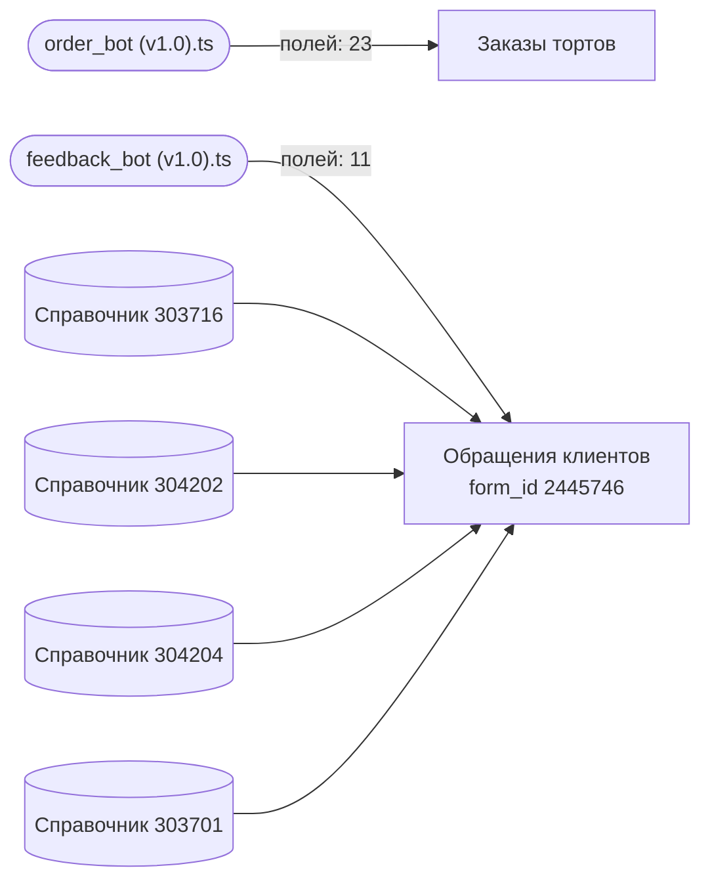

Карта строится автоматически из исходников и заголовков документов — `npm run map`. Править её руками бессмысленно: следующая генерация перезапишет файл, а `npm run check` не даст закоммитить расхождение.

Карта отвечает на вопрос «меняю поле — что сломается»: ниже видно, какой скрипт какое поле трогает.

## Схема

## Формы

| Форма | `form_id` | Справочники | Полей в спецификации | Скриптов |
| --- | --- | --- | --- | --- |
| Заказы тортов | — | — | 24 | 1 |
| Обращения клиентов | 2445746 | 303716, 304202, 304204, 303701 | 12 | 1 |

## Заказы тортов: какие поля трогают скрипты

| Поле (`code`) | Скрипты | Объявлено в спецификации |
| --- | --- | --- |
| `allergy_comment` | order\_bot (v1.0).ts | да |
| `bonus_accrual` | order\_bot (v1.0).ts | да |
| `bonus_card_create` | order\_bot (v1.0).ts | да |
| `bonus_card_exists` | order\_bot (v1.0).ts | да |
| `bonus_write_off` | order\_bot (v1.0).ts | да |
| `cake_filling` | order\_bot (v1.0).ts | да |
| `cake_for` | order\_bot (v1.0).ts | да |
| `cake_weight` | order\_bot (v1.0).ts | да |
| `child_gender` | order\_bot (v1.0).ts | да |
| `delivery_address` | order\_bot (v1.0).ts | да |
| `delivery_contact` | order\_bot (v1.0).ts | да |
| `delivery_time_range` | order\_bot (v1.0).ts | да |
| `delivery_type` | order\_bot (v1.0).ts | да |
| `design_comment` | order\_bot (v1.0).ts | да |
| `design_image` | order\_bot (v1.0).ts | да |
| `event_type` | order\_bot (v1.0).ts | да |
| `food_allergy` | order\_bot (v1.0).ts | да |
| `guest_name` | order\_bot (v1.0).ts | да |
| `guest_phone` | order\_bot (v1.0).ts | да |
| `guests_count` | order\_bot (v1.0).ts | да |
| `pickup_point` | order\_bot (v1.0).ts | да |
| `pickup_time` | order\_bot (v1.0).ts | да |
| `technical_bot_state` | order\_bot (v1.0).ts | да |
| `total_price` | — | да |

## Обращения клиентов: какие поля трогают скрипты

| Поле (`code`) | Скрипты | Объявлено в спецификации |
| --- | --- | --- |
| `Status` | feedback\_bot (v1.0).ts | да |
| `attachments` | feedback\_bot (v1.0).ts | да |
| `channel` | — | да |
| `client_email` | feedback\_bot (v1.0).ts | да |
| `client_name` | feedback\_bot (v1.0).ts | да |
| `client_phone` | feedback\_bot (v1.0).ts | да |
| `location` | feedback\_bot (v1.0).ts | да |
| `problem_description` | feedback\_bot (v1.0).ts | да |
| `problem_subject` | feedback\_bot (v1.0).ts | да |
| `problem_type` | feedback\_bot (v1.0).ts | да |
| `rating` | feedback\_bot (v1.0).ts | да |
| `technical_bot_state` | feedback\_bot (v1.0).ts | да |

