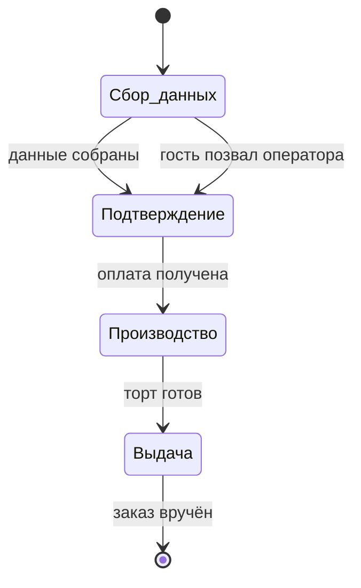

## Этапы

| № | Этап | Исполнитель (роль) | Что делает | Условие перехода дальше |
| --- | --- | --- | --- | --- |
| 1 | Сбор данных | Бот `order_bot` | Задаёт вопросы гостю в мессенджере и заполняет поля заявки | Все видимые обязательные поля заполнены, либо гость позвал оператора, либо бот сдался после 3 нераспознанных ответов |
| 2 | Подтверждение заказа | Менеджеры по продажам | Проверяет собранные ботом данные, подтверждает возможность изготовления с производством, выставляет ссылку на оплату | Получена оплата или аванс |
| 3 | Производство | Кондитеры | Изготавливает торт по спецификации, оформляет согласно `design_comment` и `design_image` | Торт готов и передан на выдачу |
| 4 | Выдача или доставка | Менеджер точки самовывоза либо курьерская служба | Передаёт торт гостю | Заказ вручён |

## Схема

## Возвраты и отклонения

| С какого этапа | Причина возврата | Куда возвращается | Кто уведомляется |
| --- | --- | --- | --- |
| Подтверждение | Данные собраны неполно или противоречиво | К оператору на уточнение с гостем | Оператор |
| Подтверждение | Производство не берётся за заказ (сроки, начинка, вес) | К менеджеру для согласования замены с гостем | Менеджер |
| Производство | Гость отменил заказ до начала изготовления | Заявка закрывается с отметкой отмены | Менеджер |

## Автоматические переходы

| Переход | Триггер | Условие | Исполняет |
| --- | --- | --- | --- |
| Следующий вопрос гостю | Комментарий гостя в задаче | Есть незаполненный видимый шаг | Бот |
| Передача оператору | Комментарий гостя | Гость попросил человека, либо 3 нераспознанных ответа подряд, либо один и тот же вопрос задан 4 раза | Бот |
| Завершение сбора | Комментарий гостя | Незаполненных видимых шагов не осталось | Бот |

Переход между этапами 2–4 делает человек: бот работает только на первом этапе.

## Требует уточнения у заказчика

- Нормативы времени на каждом этапе и поведение при просрочке.
- Кто именно входит в роли «Менеджеры по продажам» и «Кондитеры».
- Нужен ли отдельный этап между оплатой и производством (например, закупка нестандартных ингредиентов).
