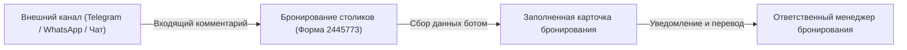

## Зачем этот процесс

Форма **«Бронирование столиков» (ID 2445773)** предназначена для автоматического первичного сбора информации с клиентов, желающих забронировать столик или подать заявку на участие в мероприятии через внешние каналы (расширение Pyrus: Telegram, чаты на сайте или другие мессенджеры).

До внедрения автобота операторам приходилось вручную запрашивать имя, телефон, тип визита, дату, время и количество гостей в свободном диалоге, что увеличивало время обработки каждой заявки. Автобот собирает первичные данные по шагам и передаёт полностью заполненную задачу менеджеру бронирования.

## Кто участвует

| Роль | Что делает | Кто это в организации клиента |
| --- | --- | --- |
| Гость / Заявитель | Запрашивает бронирование стола или мероприятие через мессенджер, отвечает на вопросы бота | Внешний клиент ресторана / заведения |
| Бот бронирования (`booking_bot`) | Ведёт диалог по шагам, распознаёт ответы, проверяет условия видимости, заполняет поля формы | Серверный бот Pyrus API (`booking_bot.ts`) |
| Ответственный менеджер | Проверяет наличие свободных мест, связывается с гостем для подтверждения и завершает заявку | Сотрудник отдела бронирования / администратор |

## Граф зависимостей

Процесс изолирован внутри формы 2445773 с передачей управления оператору.

| Связь | Направление | Что передаётся | Что сломается при изменении |
| --- | --- | --- | --- |
| Pyrus Extension (Мессенджеры) | Входящая | Сообщения гостя, контактные данные, файлы | Если канал отключен, сообщения не поступают |
| Форма 2445773 → Менеджер | Исходящая | Карточка с заполненными полями `guest_name`, `booking_date`, `guests_count`, `hall_zone` | Если менеджер не назначит ответственного, задача останется без внимания |

## Границы процесса

- **Входит в объём:**
  - Пошаговый опрос гостя через диалог Pyrus (имя, телефон, email, тип заявки, мероприятие, кол-во гостей, зал/зона, пожелания, дата/время).
  - Распознавание вариантов из справочников (303729, 303727, 303731).
  - Автоматическая обработка вызова оператора («оператор», «человек», «менеджер»).
  - Передача задачи менеджеру при завершении опроса или 3 неуспешных попытках.
- **Не входит:**
  - Прямая интеграция с кассовыми системами (iiko / R-Keeper) для автоматической посадкой в зале (выполняется менеджером).
  - Приём онлайн-оплаты и депозитов (ведётся отдельным подпроцессом).

## Требования заказчика

1. Бот обязан опрашивать гостя строго по порядку заданных полей, запрашивая только те поля, которые видны с учётом условий `visibility_condition`.
2. Если гость выбирает тип заявки «Мероприятие (Событие)», бот уточняет наименование мероприятия из справочника `303727`. При выборе «Другое» запрашивается текстовое уточнение.
3. Бот должен быть устойчив к некорректным ответам гостя, предлагая повторный выбор или подсказку по формату.
4. При вводе триггеров перевода на оператора («оператор», «человек», «менеджер») бот немедленно передаёт диалог сотруднику.
5. При завершении сбора данных бот меняет статус заявки на «Новая» и уведомляет менеджера.

## Нефункциональные требования

- **Часовой пояс аккаунта Pyrus клиента:** UTC+4 (Самара / Саратов). Время визита пересчитывается со смещением +4 часа.
- **Дедупликация событий:** бот игнорирует собственные сообщения и повторные вебхуки по `last_event_key`.
- **Хранение состояния:** состояние хранится в полях задачи (`technical_bot_state`, id 20).
- **Производительность:** время отклика бота не превышает 1.5 секунд на шаг.

## Открытые вопросы

| Вопрос | Кому адресован | Статус |
| --- | --- | --- |
| Время работы заведения и автоматическая отбивка в нерабочее время | Заказчик | Зафиксировано (обрабатывается стандартным сообщением) |
