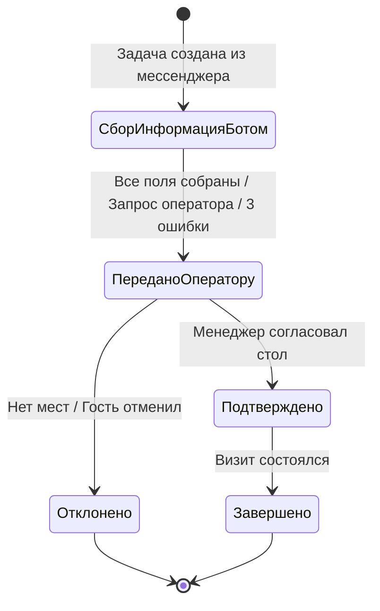

## Маршрут задачи бронирования

Маршрутизация задачи строится на смене ответственного лица и статусов задачи по мере прохождения этапов.

## Этапы и ответственные

| Этап | Статус `Status` | Статус заявки (Каталог 303732) | Ответственный | Действие |
| --- | --- | --- | --- | --- |
| 1. Первичный опрос | 2: В работе / 3: Ожидание ответа | 179704752 (Новая) | `booking_bot` | Бот ведёт опрос гостя |
| 2. Проверка и подтверждение | 1: Новая / 2: В работе | 179704754 (Ожидает подтверждения) | Менеджер бронирования | Менеджер проверяет столик и связывается с гостем |
| 3. Согласовано | 4: Подтверждена | 179704753 (Подтверждена) | Менеджер бронирования | Бронь зафиксирована |
| 4. Завершено / Отклонено | 5: Отклонена / 6: Завершена | 179704797 (Отклонена) / 179704817 (Завершена) | Менеджер бронирования | Финальный статус карточки |
