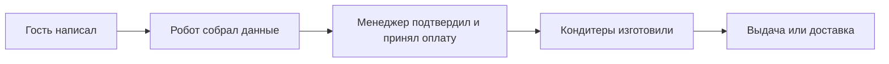

## Что это

Процесс приёма заказов на торты. Гость пишет нам в мессенджер, робот задаёт ему вопросы по одному и заполняет заявку: имя, телефон, повод, вес, начинка, пожелания по оформлению, доставка или самовывоз. Когда всё собрано, заявка уходит менеджеру.

Раньше эти же вопросы задавал человек, переписываясь с каждым гостем вручную и перенося ответы в форму.

## Кто с этим работает

| Кто | Что делает |
| --- | --- |
| Гость | Пишет в мессенджер и отвечает на вопросы робота |
| Оператор | Подключается, когда робот не справился или гость попросил человека |
| Менеджер по продажам | Проверяет заявку, подтверждает заказ, выставляет оплату |
| Кондитер | Изготавливает торт по заявке |
| Менеджер точки или курьер | Передаёт торт гостю |

## Как выглядит путь заявки

1. Гость пишет в мессенджер — создаётся заявка.
2. Робот задаёт вопросы и заполняет заявку.
3. Менеджер проверяет заказ и выставляет оплату.
4. После оплаты заказ уходит в производство.
5. Готовый торт выдают или доставляют.

## Что делает робот, а что человек

| Шаг | Кто выполняет |
| --- | --- |
| Задать вопросы и заполнить заявку | Робот |
| Разобраться, если гость ответил непонятно | Оператор |
| Подтвердить заказ и принять оплату | Менеджер |
| Изготовить торт | Кондитеры |
| Передать заказ гостю | Менеджер точки или курьер |

Робот собирает данные, но решения не принимает. Если он трижды подряд не понял ответ или гость попросил живого человека, робот сам передаёт разговор оператору и больше в него не вмешивается.

Вопросы задаются не все подряд: часть зависит от предыдущих ответов. Например, адрес спросят только при доставке, а пол ребёнка — только если повод «детский день рождения».

## Сроки

Требует уточнения: нормативы времени на подтверждение заказа, изготовление и доставку с заказчиком не согласованы.
