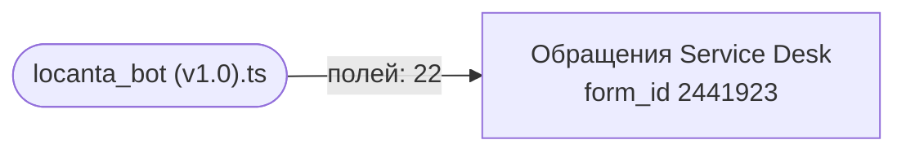

Карта строится автоматически из исходников и заголовков документов — `npm run map`. Править её руками бессмысленно: следующая генерация перезапишет файл, а `npm run check` не даст закоммитить расхождение.

Карта отвечает на вопрос «меняю поле — что сломается»: ниже видно, какой скрипт какое поле трогает.

## Схема

## Формы

| Форма | `form_id` | Справочники | Полей в спецификации | Скриптов |
| --- | --- | --- | --- | --- |
| Обращения Service Desk | 2441923 | — | 35 | 1 |

## Обращения Service Desk: какие поля трогают скрипты

| Поле (`code`) | Скрипты | Объявлено в спецификации |
| --- | --- | --- |
| `Attachments` | — | да |
| `Dadata_Inn` | — | да |
| `Dadata_inn` | locanta_bot (v1.0).ts | **нет** |
| `Manager` | locanta_bot (v1.0).ts | **нет** |
| `Message` | — | да |
| `Operator` | locanta_bot (v1.0).ts | **нет** |
| `PhoneNumberFrom` | locanta_bot (v1.0).ts | да |
| `Rating` | — | да |
| `Responsible` | locanta_bot (v1.0).ts | да |
| `SenderEmail` | — | да |
| `SenderName` | locanta_bot (v1.0).ts | да |
| `Status` | locanta_bot (v1.0).ts | да |
| `Subject` | — | да |
| `Task_type` | locanta_bot (v1.0).ts | да |
| `channel_task` | locanta_bot (v1.0).ts | да |
| `client_name` | locanta_bot (v1.0).ts | да |
| `max_id` | — | да |
| `message_chanell_id` | locanta_bot (v1.0).ts | да |
| `priority` | locanta_bot (v1.0).ts | да |
| `pusk_respons` | locanta_bot (v1.0).ts | **нет** |
| `restoran` | locanta_bot (v1.0).ts | да |
| `restoran_table` | locanta_bot (v1.0).ts | да |
| `table_access_enter` | — | да |
| `table_access_object` | — | да |
| `table_access_type` | — | да |
| `task_clients` | locanta_bot (v1.0).ts | да |
| `task_stage` | — | да |
| `tehnikal_text` | locanta_bot (v1.0).ts | да |
| `telegram_id` | — | да |
| `type_of_service` | locanta_bot (v1.0).ts | **нет** |
| `u_cabinet` | — | да |
| `u_client` | locanta_bot (v1.0).ts | да |
| `u_contract_status` | — | да |
| `u_crmid` | locanta_bot (v1.0).ts | да |
| `u_dogovor` | — | да |
| `u_enddate` | — | да |
| `u_op` | — | да |
| `u_set` | locanta_bot (v1.0).ts | да |
| `u_uid` | — | да |
| `zapusk_bota` | locanta_bot (v1.0).ts | да |

Поля, которые скрипт использует, но которых нет в спецификации: `Dadata_inn`, `Manager`, `Operator`, `pusk_respons`, `type_of_service`. Либо спецификация отстала, либо в коде опечатка — расхождение разбирается, а не игнорируется.
