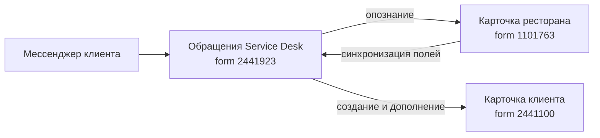

Документация восстановлена по работающему решению (обратная разработка). Описано фактическое поведение бота; то, что известно только заказчику, вынесено в раздел «Требует уточнения».

## Зачем этот процесс

Рестораны, обслуживаемые на iiko, обращаются в поддержку через мессенджер. Обращение попадает в Pyrus задачей формы Service Desk. Дальше нужно понять три вещи, прежде чем передавать заявку инженеру: **какое это заведение**, **что за обращение** и **насколько срочно**.

Раньше это выяснял оператор перепиской. Бот берёт на себя опознание заведения и класс обращения, оставляя человеку саму поддержку.

Опознание заведения — не формальность: без привязки к карточке ресторана в заявке нет ни доступов, ни истории обслуживания, и инженер начинает с нуля.

## Кто участвует

| Роль | Что делает |
| --- | --- |
| Клиент (сотрудник ресторана) | Пишет в мессенджер, отвечает на вопросы бота |
| Бот `locanta_bot` | Опознаёт заведение, заводит карточку клиента, уточняет класс обращения |
| Оператор | Подключается, когда бот передал диалог |
| Ответственный | Решает обращение по существу |
| Менеджер | Ведёт клиента |

## Граф зависимостей

| Связь | Направление | Что передаётся |
| --- | --- | --- |
| Карточка ресторана → Service Desk | входящая | Поля заведения по совпадению кодов, ИНН, CRMID |
| Service Desk → карточка клиента | исходящая | Строка таблицы заведений: CRMID, ИНН, название, ссылка |
| Мессенджер → Service Desk | входящая | Текст обращения, имя отправителя, телефон, ID канала |

## Границы процесса

- **Входит в объём:** приём обращения, опознание заведения, заведение карточки клиента, уточнение класса обращения, передача оператору.
- **Не входит:** решение самого обращения, выезд инженера, биллинг. Бот доводит заявку до состояния «понятно, кто и с чем обратился», дальше работают люди.

## Требования, восстановленные из реализации

1. Бот реагирует на обращение в задаче формы `2441923`.
2. Если заведение уже привязано к клиенту, бот предлагает выбрать из списка известных заведений.
3. Если заведений не найдено, бот запрашивает ИНН или CRMID.
4. Найденное заведение бот показывает клиенту и просит подтвердить «да / нет» — привязка вслепую не делается.
5. Бот уточняет класс обращения: консультация, удалённо, выезд.
6. Приоритет бот не спрашивает — шаг выключен флагом.
7. По просьбе клиента бот передаёт диалог человеку и в разговор больше не вмешивается.
8. Об изменении ответственного, статуса, приоритета, класса обращения и привязки заведения участники уведомляются; о смене оператора — нет.

## Нефункциональные требования

- **Отсутствие состояния в памяти.** Ход диалога хранится в поле `tehnikal_text` задачи.
- **Защита от зацикливания.** Бот игнорирует собственные комментарии.
- **Скрытое логирование.** Служебные сообщения уходят внутренним комментарием без канала.
- **Универсальность.** Шаги и синхронизации включаются флагами: один бот обслуживает разные конфигурации процесса.

## Требует уточнения у заказчика

1. **Часовой пояс аккаунта Pyrus** — в коде не задан, а поля времени в процессе есть.
2. **Объём:** сколько обращений в месяц и сколько заведений в справочнике клиента.
3. **Что считать успехом:** доля обращений, опознанных ботом без оператора.
4. **Нормативы времени** по приоритетам: `High` описан как «невозможен расчёт гостей», но срок реакции в коде не закреплён.
5. **Кто владелец процесса** со стороны заказчика.
