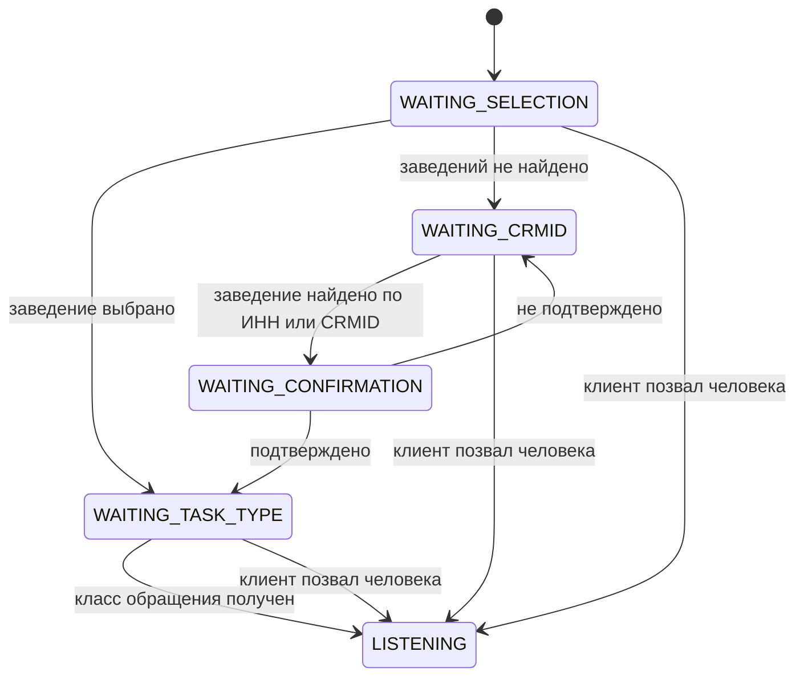

Ниже описан **диалоговый маршрут бота** — он восстановлен из кода полностью. Маршрут самой задачи по этапам согласования известен заказчику и запрошен.

## Диалог бота

| Шаг | Состояние | Что бот делает | Условие перехода |
| --- | --- | --- | --- |
| 1 | `WAITING_SELECTION` | Показывает список известных заведений клиента и ждёт выбора | Клиент выбрал заведение |
| 2 | `WAITING_CRMID` | Если заведений не нашлось — просит ИНН или CRMID | Получен идентификатор, заведение найдено |
| 3 | `WAITING_CONFIRMATION` | Показывает найденное заведение и просит подтвердить | Клиент ответил «да» |
| 4 | `WAITING_TASK_TYPE` | Спрашивает класс обращения: консультация, удалённо, выезд | Получен ответ |
| 5 | `WAITING_PRIORITY` | Спрашивает приоритет | **Шаг выключен флагом**, пропускается |
| 6 | `LISTENING` | Опрос закончен, бот слушает диалог и не вмешивается | — |

Отдельно, вне основной последовательности: `WAITING_PHONE` и `WAITING_PHONE_ONCE` — запрос контактного телефона, если он не пришёл из мессенджера.

Последовательность шагов не жёсткая: следующий шаг выбирается функцией, которая пропускает выключенные флагами и уже пройденные. Поэтому отключение любого вопроса не ломает диалог, а просто убирает его.

## Выход из диалога к человеку

| Причина | Что делает бот |
| --- | --- |
| Клиент попросил человека | Прекращает опрос, переходит в `LISTENING` |
| Заведение не подтверждено и не найдено повторно | Передаёт оператору |
| Внутренняя ошибка | Пишет клиенту нейтральный текст, подробности — во внутренний комментарий |

После передачи человеку бот в разговор не возвращается.

## Уведомления при смене полей

| Что изменилось | Уведомлять |
| --- | --- |
| Ответственный | Да |
| Статус | Да |
| Приоритет | Да |
| Класс обращения | Да |
| Привязка заведения | Да |
| Оператор | Нет |

## Требует уточнения у заказчика

1. **Этапы обработки самой заявки** после того, как бот закончил: кто и в каком порядке ведёт обращение до закрытия, какие статусы существуют и что означает каждый.
2. **Условия перехода** между этапами и кто их выполняет.
3. **Сроки** по каждому приоритету и что происходит при просрочке.
4. **Возвраты:** куда уходит обращение, если ответственный не может его решить.
5. Ставится ли галочка `zapusk_bota` вручную или маршрутом.
