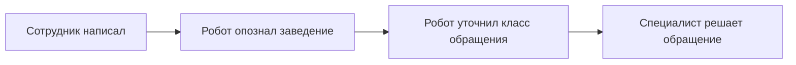

## Что это

Приём обращений в поддержку от ресторанов. Сотрудник ресторана пишет нам в мессенджер, робот уточняет, о каком заведении речь и что за обращение, и передаёт заявку специалисту.

## Зачем робот уточняет заведение

Без привязки к конкретному заведению в заявке нет ни доступов, ни истории обслуживания — специалист начинает разбираться с нуля и первым делом всё равно спрашивает то же самое. Робот делает это сразу и без ожидания.

## Кто участвует

| Кто | Что делает |
| --- | --- |
| Сотрудник ресторана | Пишет в мессенджер, отвечает на вопросы робота |
| Робот | Опознаёт заведение, заводит карточку клиента, уточняет класс обращения |
| Оператор | Подключается, когда робот передал разговор |
| Ответственный | Решает обращение |

## Как выглядит путь обращения

1. Сотрудник пишет в мессенджер — создаётся обращение.
2. Робот уточняет заведение: предлагает выбрать из известных либо просит ИНН или CRMID.
3. Робот показывает найденное заведение и просит подтвердить.
4. Робот уточняет класс обращения: консультация, удалённо или выезд.
5. Дальше обращение ведёт специалист.

## Что делает робот, а что человек

Робот только собирает исходные данные. Он не решает обращение, не называет сроков и не определяет срочность: приоритет ставит сотрудник поддержки.

Если вы попросите живого человека, робот прекратит задавать вопросы и передаст разговор коллеге. Возвращаться в диалог он больше не будет.

## Сроки

Требует уточнения: нормативы времени реакции по каждому приоритету с заказчиком не зафиксированы.
