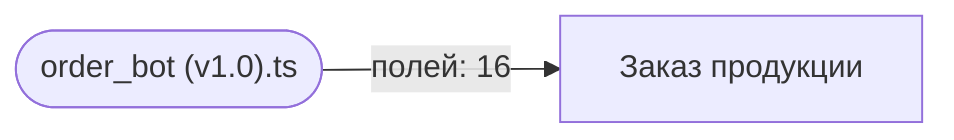

Карта строится автоматически из исходников и заголовков документов — `npm run map`. Править её руками бессмысленно: следующая генерация перезапишет файл, а `npm run check` не даст закоммитить расхождение.

Карта отвечает на вопрос «меняю поле — что сломается»: ниже видно, какой скрипт какое поле трогает.

## Схема

## Формы

| Форма | `form_id` | Справочники | Полей в спецификации | Скриптов |
| --- | --- | --- | --- | --- |
| Заказ продукции | — | — | 15 | 1 |

## Заказ продукции: какие поля трогают скрипты

| Поле (`code`) | Скрипты | Объявлено в спецификации |
| --- | --- | --- |
| `cake_filling` | order_bot (v1.0).ts | да |
| `cake_weight` | order_bot (v1.0).ts | да |
| `client_name` | order_bot (v1.0).ts | да |
| `client_phone` | order_bot (v1.0).ts | да |
| `custom_order_description` | order_bot (v1.0).ts | да |
| `delivery_type` | order_bot (v1.0).ts | да |
| `design` | order_bot (v1.0).ts | да |
| `design_image` | order_bot (v1.0).ts | да |
| `order_items` | order_bot (v1.0).ts | да |
| `period` | — | да |
| `pickup_date` | order_bot (v1.0).ts | да |
| `pickup_point` | order_bot (v1.0).ts | да |
| `pickup_time` | order_bot (v1.0).ts | да |
| `positions` | order_bot (v1.0).ts | **нет** |
| `product_type` | order_bot (v1.0).ts | да |
| `quantity` | order_bot (v1.0).ts | да |
| `technical_bot_state` | order_bot (v1.0).ts | **нет** |

Поля, которые скрипт использует, но которых нет в спецификации: `positions`, `technical_bot_state`. Либо спецификация отстала, либо в коде опечатка — расхождение разбирается, а не игнорируется.
