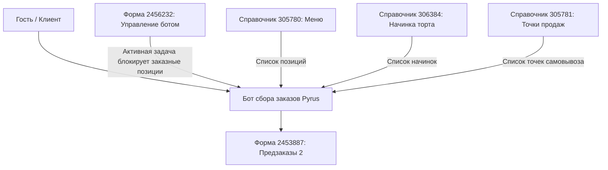

## Зачем этот процесс

Автоматизация сбора предзаказов кондитерской продукции и тортов с индивидуальным дизайном от гостей через интерактивного бота Pyrus. Бот проводит клиента по 13 вопросам, собирает параметры заказа (готовые позиции из меню, торты на заказ с выбором начинки и веса от 2 кг, референсы дизайна), запрашивает дату и время получения, способ получения (самовывоз/доставка) и автоматически формирует карточку заказа для производства.

## Кто участвует

| Роль | Что делает | Кто это в организации клиента |
| --- | --- | --- |
| Заказчик (Гость) | Оформляет заявку в диалоговом боте Pyrus | Клиент кондитерской «Белый Фартук» |
| Серверный бот Pyrus | Проводит опросы, валидирует данные (вес, даты, формат телефона) | ИИ-ассистент сбора заказов (Форма 2453887) |
| Администратор | Управляет доступностью приема заказных позиций через управляющую форму (ID 2456232) | Менеджер кондитерской |
| Производство / Цех | Изготавливает продукцию к выбранной дате и времени | Кондитеры |

## Граф зависимостей

| Связь | Направление | Что передаётся | Что сломается при изменении |
| --- | --- | --- | --- |
| Управление ботом (ID 2456232) | входящая | Активные задачи управления (срок не просрочен) | Перестанет работать автоматическая отбивка блокировки заказных тортов |
| Справочник Меню (ID 305780) | входящая | Готовые позиций каталога и категории | Бот не сможет выдать актуальное меню гостю |
| Справочник Начинки (ID 306384) | входящая | Варианты начинок тортов на заказ | Гость не сможет выбрать начинку для заказного торта |
| Справочник Точки (ID 305781) | входящая | Список адресов самовывоза | Гость не сможет выбрать точку самовывоза |

## Границы процесса

- **Входит в объём:**
  - Пошаговый опрос гостя по 13 вопросам.
  - Проверка блокировки заказных тортов через форму 2456232 («Управление ботом»).
  - Валидация веса торта на заказ (минимальный вес — 2 кг).
  - Проверка минимального срока изготовления (не менее 4 рабочих дней, без учета СБ и ВС).
  - Разделение сценария доставки (выдача ссылки на сайт `https://белыйфартук.рф/`) и самовывоза (выбор точки из справочника 305781).
- **Не входит:**
  - Приём онлайн-оплаты в чате (оплата и доставка оформляются через сайт или при получении).
  - Интеграция с кассовыми системами iiko/R-Keeper (заказ передаётся ответственным через Pyrus).

## Требования заказчика

1. **Вопрос 1 (Имя):** Бот запрашивает имя гостя.
2. **Вопрос 2 (Телефон):** Бот запрашивает телефон, валидируя формат `7XXXXXXXXXX`.
3. **Вопрос 3 (Тип продукции):** Выбор: `1` — Торт на заказ с индивидуальным дизайном, `2` — Готовые позиции из каталога. При выборе `1`, если в форме 2456232 есть непросроченная задача, бот высылает отбивку: *«Добрый день, к сожалению, сейчас мы временно не принимаем заказы с индивидуальным дизайном. Пожалуйста, выберите готовые позиции из каталога или зайдите позже.»* и возвращает к выбору.
4. **Вопрос 4 (Тип торта):** Выбор: `1` — Бенто торт, `2` — Торт от 2 кг.
5. **Вопрос 5 (Начинка):** Выбор из справочника 306384.
6. **Вопрос 6 (Вес):** Для торта от 2 кг — ввод числа $\ge 2$ кг. При $<2$ кг — повторный запрос: *«Вес должен быть не менее 2 кг. Попробуйте снова.»*.
7. **Вопрос 7 (Дизайн):** Запрос фото-референса или текстового описания дизайна.
8. **Вопрос 8 (Выбор позиций):** Выбор позиции из справочника 305780 («Меню»).
9. **Вопрос 9 (Количество):** Указание количества выбранной позиции.
10. **Вопрос 10 (Дата получения):** Запрос даты ДД.ММ.ГГГГ. Минимальный срок — через 4 рабочих дня (суббота и воскресенье пропускаются). Если меньше — сообщение: *«К сожалению, мы не можем изготовить заказ к этой дате. Выберите дату не ранее, чем через 4 рабочих дня.»*.
11. **Вопрос 11 (Время получения):** Запрос времени в формате ЧЧ:ММ.
12. **Вопрос 12 (Способ получения):** `1` — Самовывоз, `2` — Доставка. При `2` бот сообщает: *«Доставка осуществляется только через наш сайт. Пожалуйста, оформите доставку на сайте: https://белыйфартук.рф/?ysclid=mspy6odhv7512300021. Ваш заказ будет передан на производство. Мы свяжемся с Вами для подтверждения.»* и завершает диалог.
13. **Вопрос 13 (Точка самовывоза):** При выборе самовывоза — выбор точки из справочника 305781.

## Нефункциональные требования

- **Часовой пояс аккаунта Pyrus клиента:** UTC+4 (Тольятти / Самара).
- **Дедупликация событий:** бот игнорирует собственные сообщения и дублирование событий Webhook.
- **Хранение состояния:** текущий шаг опроса хранятся в техническом поле состояния.
- **Каталоги:** бот запрашивает составы справочников динамически через Pyrus API.

## История изменений

- v1.0 (12.08.2026): Согласовано Первичное ТЗ сбора заказов кондитерской продукции.
