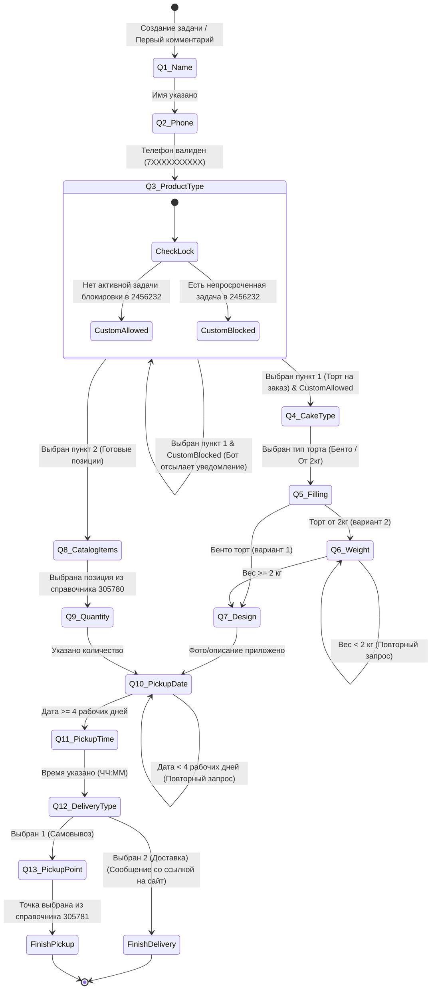

## Пошаговый сценарий диалога бота

## Правила перехода и валидация

1. **Имя гостя:** Произвольный текст.
2. **Телефон:** Строгая валидация формата (11 цифр, начинающихся с 7).
3. **Блокировка заказов:** Запрос задач в форме `2456232` без закрытых. Если есть задача с `period` $\ge$ текущего времени, отбивка блокировки.
4. **Вес торта:** От 2 кг. Округление/парсинг чисел.
5. **Рабочие дни:** Формирование минимальной доступной даты с учётом +4 рабочих дней (СБ и ВС не считаются).
6. **Доставка:** Отправка клиенту прямой ссылки `https://белыйфартук.рф/?ysclid=mspy6odhv7512300021` без обязательного запроса точки самовывоза.
