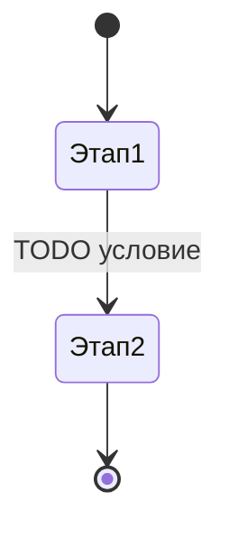

## Этапы

| № | Этап | Исполнитель (роль) | Что делает | Условие перехода дальше |
| --- | --- | --- | --- | --- |
| 1 | TODO | TODO | TODO | TODO |

## Схема

## Возвраты и отклонения

Куда задача уходит, если этап не пройден. Незадокументированный возврат — самая частая причина «задача зависла и никто не знает, у кого она».

| С какого этапа | Причина возврата | Куда возвращается | Кто уведомляется |
| --- | --- | --- | --- |
| TODO | TODO | TODO | TODO |

## Сроки

| Этап | Норматив | Что происходит при просрочке |
| --- | --- | --- |
| TODO | TODO часов | TODO |

## Автоматические переходы

Какие переходы делает бот, а какие — человек. Для каждого автоматического: триггер и условие.

| Переход | Триггер | Условие | Исполняет |
| --- | --- | --- | --- |
| TODO | TODO | TODO | бот / человек |
