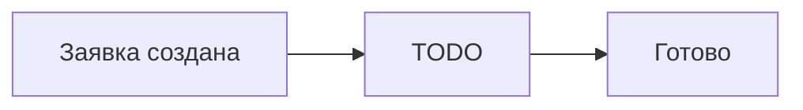

## Что это

TODO: одним абзацем, что за процесс и какую задачу он решает. Без технических терминов и кодов полей.

## Кто с этим работает

| Кто | Что делает |
| --- | --- |
| TODO | TODO |

## Как выглядит путь заявки

1. TODO — с чего всё начинается.
2. TODO.
3. TODO — чем заканчивается.

## Что делает робот, а что человек

| Шаг | Кто выполняет |
| --- | --- |
| TODO | робот |
| TODO | TODO сотрудник |

Робот собирает данные и заполняет поля, но решения принимает человек. Если робот не понял ответ клиента несколько раз подряд, он сам передаёт диалог оператору.

## Сроки

| Этап | Сколько занимает |
| --- | --- |
| TODO | TODO |
